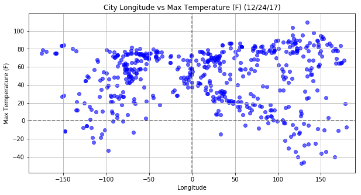
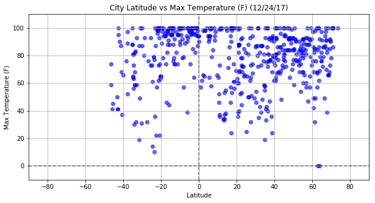
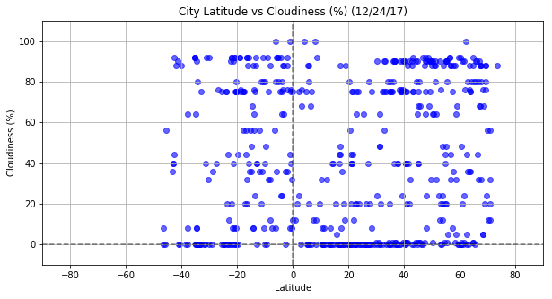

# WeatherPy

Whether financial, political, or social -- data's true power lies in its ability to answer questions definitively. 

The Analysis consists in visualizing the weather of 500+ cities across the world of varying distance from the equator and 
creating a representative model of weather across world cities.


```python
# Dependencies
import numpy as np
import pandas as pd
import matplotlib.pyplot as plt
import requests as req
import time
from datetime import datetime

import openweathermapy.core as ow
from citipy import citipy

```

### FUNCTIONS SECTION


```python
# Return coordinates of latitude and longitude 

def coordinates_func():
    # values should be between -90, 90  and -180, 180 
    return np.random.uniform(-92, 92), np.random.uniform(-182,182) 

```


```python
# Change First character of string to uppercase

def first_upper(s):
   if len(s) == 0:
      return s
   else:
      return s[0].upper() + s[1:]

```


```python
# Given a filename , return the contents of that file

def get_file_contents(filename):
    try:
        with open(filename, 'r') as f:
            # It's assumed our file contains a single line, with our API key
            return f.read().strip()
    except FileNotFoundError:
        print("'%s' file not found" % filename)
```


```python
# Convert DATE in string format '%Y-%m-%d %H:%M:%S' to "%m/%d/%Y" or '%x'local format (US format)

def convert_date(day):
    
    day_str = datetime.strptime(str(day), '%Y-%m-%d %H:%M:%S')
    
    return(datetime.strftime(day_str, "%x"))
   
```


```python
# The function is used for adding labels, getting the limits and saving the figure.

def set_plot_labels(x_title, y_title, day, x_limit , y_limit, savefig):
    
    # Add labels to the x and y axes
    
    title = "City "  +  x_title + " vs " + y_title + ' (' + day + ')'
    plt.title(title)
    plt.xlabel(x_title)    
    plt.ylabel(y_title)
    plt.grid(True)
    
    # Getting the limits
    plt.xlim(x_limit)
    plt.ylim(y_limit)
    plt.axvline(0, color='black', linestyle='dashed', alpha=0.5)
    plt.axhline(0, color='black', linestyle='dashed', alpha=0.5)
    figure_name="charts/WeatherPy_" + savefig + ".png"
    plt.savefig(figure_name)

```

### Generate Cities List

Randomly select at least 1000 unique (non-repeat) cities based on latitude and longitude.


```python
# Create a dataframe that randomly hold latitude, longitude, Near city, Near country

cities_df = pd.DataFrame()
cities_df['Near Latitude'] = " "
cities_df['Near Longitude'] = " "
cities_df['Near City'] = " "
cities_df['Country Code'] = " "

for x in range(3000):
    
    # Call coordinates function to generate randomly a pair of latitude, longitude
    lat_long = coordinates_func() 
    lat, long = lat_long
    
    # Get the city and the country code
    city= citipy.nearest_city(lat, long)
    cityname = first_upper(city.city_name)
    country = city.country_code.upper()
    
    # Fill up the Dataframe    
    cities_df.set_value(x,"Near Latitude",lat)
    cities_df.set_value(x,"Near Longitude",long)
    cities_df.set_value(x,"Near City",cityname)
    cities_df.set_value(x,"Country Code",country)
    
cities_df.describe()

```


<div>
<style>
    .dataframe thead tr:only-child th {
        text-align: right;
    }

    .dataframe thead th {
        text-align: left;
    }

    .dataframe tbody tr th {
        vertical-align: top;
    }
</style>
<table border="1" class="dataframe">
  <thead>
    <tr style="text-align: right;">
      <th></th>
      <th>Near Latitude</th>
      <th>Near Longitude</th>
      <th>Near City</th>
      <th>Country Code</th>
    </tr>
  </thead>
  <tbody>
    <tr>
      <th>count</th>
      <td>3000.000000</td>
      <td>3000.000000</td>
      <td>3000</td>
      <td>3000</td>
    </tr>
    <tr>
      <th>unique</th>
      <td>3000.000000</td>
      <td>3000.000000</td>
      <td>984</td>
      <td>144</td>
    </tr>
    <tr>
      <th>top</th>
      <td>-1.402136</td>
      <td>-1.556011</td>
      <td>Rikitea</td>
      <td>RU</td>
    </tr>
    <tr>
      <th>freq</th>
      <td>1.000000</td>
      <td>1.000000</td>
      <td>113</td>
      <td>341</td>
    </tr>
  </tbody>
</table>
</div>


### Cleaning cities data

Finding how many duplicates cities are in the dataframe cities.df and  removing them with keeping only one ocurrence. 


```python
cities_df.duplicated(subset=['Near City', 'Country Code']).sum()

cities_df.loc[cities_df.duplicated(subset=['Near City', 'Country Code'])].head()

```


<div>
<style>
    .dataframe thead tr:only-child th {
        text-align: right;
    }

    .dataframe thead th {
        text-align: left;
    }

    .dataframe tbody tr th {
        vertical-align: top;
    }
</style>
<table border="1" class="dataframe">
  <thead>
    <tr style="text-align: right;">
      <th></th>
      <th>Near Latitude</th>
      <th>Near Longitude</th>
      <th>Near City</th>
      <th>Country Code</th>
    </tr>
  </thead>
  <tbody>
    <tr>
      <th>15</th>
      <td>-60.1264</td>
      <td>-178.379</td>
      <td>Vaini</td>
      <td>TO</td>
    </tr>
    <tr>
      <th>25</th>
      <td>-88.9992</td>
      <td>-21.5232</td>
      <td>Ushuaia</td>
      <td>AR</td>
    </tr>
    <tr>
      <th>34</th>
      <td>62.1057</td>
      <td>-108.355</td>
      <td>Yellowknife</td>
      <td>CA</td>
    </tr>
    <tr>
      <th>37</th>
      <td>-71.0555</td>
      <td>-26.6881</td>
      <td>Ushuaia</td>
      <td>AR</td>
    </tr>
    <tr>
      <th>39</th>
      <td>-78.7243</td>
      <td>84.5259</td>
      <td>Busselton</td>
      <td>AU</td>
    </tr>
  </tbody>
</table>
</div>


```python
# Drop duplicate rows in cities_df except for the first ocurrence.

cities_df.drop_duplicates(subset=['Near City', 'Country Code'], keep="first", inplace=True)
cities_df.head()

```


<div>
<style>
    .dataframe thead tr:only-child th {
        text-align: right;
    }

    .dataframe thead th {
        text-align: left;
    }

    .dataframe tbody tr th {
        vertical-align: top;
    }
</style>
<table border="1" class="dataframe">
  <thead>
    <tr style="text-align: right;">
      <th></th>
      <th>Near Latitude</th>
      <th>Near Longitude</th>
      <th>Near City</th>
      <th>Country Code</th>
    </tr>
  </thead>
  <tbody>
    <tr>
      <th>0</th>
      <td>0.937464</td>
      <td>73.931</td>
      <td>Viligili</td>
      <td>MV</td>
    </tr>
    <tr>
      <th>1</th>
      <td>40.3065</td>
      <td>174.503</td>
      <td>Nikolskoye</td>
      <td>RU</td>
    </tr>
    <tr>
      <th>2</th>
      <td>-10.4589</td>
      <td>-23.8301</td>
      <td>Georgetown</td>
      <td>SH</td>
    </tr>
    <tr>
      <th>3</th>
      <td>30.3989</td>
      <td>104.892</td>
      <td>Jiancheng</td>
      <td>CN</td>
    </tr>
    <tr>
      <th>4</th>
      <td>48.6061</td>
      <td>84.0054</td>
      <td>Kurchum</td>
      <td>KZ</td>
    </tr>
  </tbody>
</table>
</div>


```python
cities_df.describe()
```


<div>
<style>
    .dataframe thead tr:only-child th {
        text-align: right;
    }

    .dataframe thead th {
        text-align: left;
    }

    .dataframe tbody tr th {
        vertical-align: top;
    }
</style>
<table border="1" class="dataframe">
  <thead>
    <tr style="text-align: right;">
      <th></th>
      <th>Near Latitude</th>
      <th>Near Longitude</th>
      <th>Near City</th>
      <th>Country Code</th>
    </tr>
  </thead>
  <tbody>
    <tr>
      <th>count</th>
      <td>985.000000</td>
      <td>985.000000</td>
      <td>985</td>
      <td>985</td>
    </tr>
    <tr>
      <th>unique</th>
      <td>985.000000</td>
      <td>985.000000</td>
      <td>984</td>
      <td>144</td>
    </tr>
    <tr>
      <th>top</th>
      <td>-1.587466</td>
      <td>-1.937249</td>
      <td>San ramon</td>
      <td>RU</td>
    </tr>
    <tr>
      <th>freq</th>
      <td>1.000000</td>
      <td>1.000000</td>
      <td>2</td>
      <td>132</td>
    </tr>
  </tbody>
</table>
</div>


```python
sample_cities_df= cities_df.sample(600)
sample_cities_df.head()
```


<div>
<style>
    .dataframe thead tr:only-child th {
        text-align: right;
    }

    .dataframe thead th {
        text-align: left;
    }

    .dataframe tbody tr th {
        vertical-align: top;
    }
</style>
<table border="1" class="dataframe">
  <thead>
    <tr style="text-align: right;">
      <th></th>
      <th>Near Latitude</th>
      <th>Near Longitude</th>
      <th>Near City</th>
      <th>Country Code</th>
    </tr>
  </thead>
  <tbody>
    <tr>
      <th>1104</th>
      <td>35.6548</td>
      <td>70.2616</td>
      <td>Nuristan</td>
      <td>AF</td>
    </tr>
    <tr>
      <th>865</th>
      <td>-19.9267</td>
      <td>127.596</td>
      <td>Kununurra</td>
      <td>AU</td>
    </tr>
    <tr>
      <th>196</th>
      <td>-39.9658</td>
      <td>-38.3207</td>
      <td>Cidreira</td>
      <td>BR</td>
    </tr>
    <tr>
      <th>2558</th>
      <td>13.4659</td>
      <td>-15.412</td>
      <td>Farafenni</td>
      <td>GM</td>
    </tr>
    <tr>
      <th>225</th>
      <td>-42.2785</td>
      <td>-49.8586</td>
      <td>Mar del plata</td>
      <td>AR</td>
    </tr>
  </tbody>
</table>
</div>


### Perform API Calls

Perform a weather check on each of the cities using a series of successive API calls.


```python
# Save config information.
filename = 'apikey'

base_url = "http://api.openweathermap.org/data/2.5/weather?"
units = "imperial"

api_key = get_file_contents(filename)
print("Our API key is: %s" % (api_key))
```

    Our API key is: a076080d7b99df1af5ac7c1f4ed773f9
    


```python
set_1 = 1
count_citi= 0
weather_data = []

print("Beginning Data Retrieval")
print("-------------------------------------------------------------------------------------")

for index, row in sample_cities_df.iterrows():
      
    city= sample_cities_df.loc[index]["Near City"]
    country=sample_cities_df.loc[index]["Country Code"]
    
    count_citi+=1
    
    if (count_citi == 1):
        start_time = time.process_time()
        
    params = city + "," + country
    print("Processing Record " +  str(count_citi) +  " of Set "  + str(set_1) + " | "  + params )
    query_url = base_url + "appid=" + api_key + "&units=" + units + "&q="

    try:
        weather_response = req.get(query_url + params).json()
                
        if (weather_response.get("cod") == 200):
            weather_data.append(weather_response)
        else:
            print("City " + city + " not found")
    except:
        print ("I got an error")
        continue
   
    # Avoid locking 
    if ( count_citi == 60):
        set_1 += 1
        count_citi = 0
        end_time = time.process_time()
        processing_time = end_time - start_time
        print("Processed 60 countries in :  " + str(processing_time))
        time.sleep(30)

# Extract data from weather_data responses
city_data = [data.get("name") for data in weather_data]
country_data = [data.get("sys").get("country") for data in weather_data]
lat_data = [data.get("coord").get("lat") for data in weather_data]
lon_data = [data.get("coord").get("lon") for data in weather_data]
temp_data = [data.get("main").get("temp_max") for data in weather_data]
humidity_data = [data.get("main").get("humidity") for data in weather_data]
clouds_data = [data.get("clouds").get("all") for data in weather_data]
wind_data = [data.get("wind").get("speed") for data in weather_data]
date_data = [data.get("dt") for data in weather_data]

weather_data = {"City": city_data, "Country": country_data, "Latitude": lat_data, "Longitude": lon_data,
                "Max Temp (F)": temp_data, "Humidity (%)": humidity_data, "Cloudiness (%)": clouds_data, 
                "Win Speed (mph)": wind_data, "Date": date_data}

weather_data = pd.DataFrame(weather_data)
 
```

    Beginning Data Retrieval
    -------------------------------------------------------------------------------------
    Processing Record 1 of Set 1 | Nuristan,AF
    City Nuristan not found
    Processing Record 2 of Set 1 | Kununurra,AU
    Processing Record 3 of Set 1 | Cidreira,BR
    Processing Record 4 of Set 1 | Farafenni,GM
    Processing Record 5 of Set 1 | Mar del plata,AR
    Processing Record 6 of Set 1 | Presidencia roque saenz pena,AR
    Processing Record 7 of Set 1 | Waipawa,NZ
    Processing Record 8 of Set 1 | Lashio,MM
    Processing Record 9 of Set 1 | Pontianak,ID
    Processing Record 10 of Set 1 | Khairpur,PK
    Processing Record 11 of Set 1 | Khani,RU
    City Khani not found
    Processing Record 12 of Set 1 | Severo-kurilsk,RU
    Processing Record 13 of Set 1 | Banda aceh,ID
    Processing Record 14 of Set 1 | Sao filipe,CV
    Processing Record 15 of Set 1 | Qeshm,IR
    Processing Record 16 of Set 1 | Ahuimanu,US
    Processing Record 17 of Set 1 | Atuona,PF
    Processing Record 18 of Set 1 | Novobureyskiy,RU
    Processing Record 19 of Set 1 | Krasnorechenskiy,RU
    Processing Record 20 of Set 1 | Escanaba,US
    Processing Record 21 of Set 1 | Skagastrond,IS
    City Skagastrond not found
    Processing Record 22 of Set 1 | Buchanan,LR
    Processing Record 23 of Set 1 | Ada,US
    Processing Record 24 of Set 1 | Birsk,RU
    Processing Record 25 of Set 1 | Ramgarh,IN
    Processing Record 26 of Set 1 | Ambilobe,MG
    Processing Record 27 of Set 1 | Dudinka,RU
    Processing Record 28 of Set 1 | Harrisonville,US
    Processing Record 29 of Set 1 | Kedgwick,CA
    Processing Record 30 of Set 1 | San ramon,BO
    Processing Record 31 of Set 1 | Kirksville,US
    Processing Record 32 of Set 1 | Jiddah,SA
    City Jiddah not found
    Processing Record 33 of Set 1 | Verkhneuralsk,RU
    Processing Record 34 of Set 1 | Gizo,SB
    Processing Record 35 of Set 1 | Sangar,RU
    Processing Record 36 of Set 1 | Kendari,ID
    Processing Record 37 of Set 1 | Pacific grove,US
    Processing Record 38 of Set 1 | Pedernales,DO
    Processing Record 39 of Set 1 | Houston,CA
    Processing Record 40 of Set 1 | Prestea,GH
    Processing Record 41 of Set 1 | Camopi,GF
    Processing Record 42 of Set 1 | Mpika,ZM
    Processing Record 43 of Set 1 | Valleyview,CA
    Processing Record 44 of Set 1 | Puri,IN
    Processing Record 45 of Set 1 | Tombouctou,ML
    Processing Record 46 of Set 1 | Rocha,UY
    Processing Record 47 of Set 1 | Galiwinku,AU
    City Galiwinku not found
    Processing Record 48 of Set 1 | Anshun,CN
    Processing Record 49 of Set 1 | Tanhacu,BR
    Processing Record 50 of Set 1 | Marataizes,BR
    Processing Record 51 of Set 1 | Murgab,TM
    Processing Record 52 of Set 1 | Cururupu,BR
    Processing Record 53 of Set 1 | Acarau,BR
    City Acarau not found
    Processing Record 54 of Set 1 | Nowy targ,PL
    Processing Record 55 of Set 1 | Buraydah,SA
    Processing Record 56 of Set 1 | Acapulco,MX
    Processing Record 57 of Set 1 | Marawi,SD
    Processing Record 58 of Set 1 | Ketchikan,US
    Processing Record 59 of Set 1 | Tual,ID
    Processing Record 60 of Set 1 | Palmer,US
    Processed 60 countries in :  0.625
    Processing Record 1 of Set 2 | Mentok,ID
    City Mentok not found
    Processing Record 2 of Set 2 | San luis,AR
    Processing Record 3 of Set 2 | Pochutla,MX
    Processing Record 4 of Set 2 | Iqaluit,CA
    Processing Record 5 of Set 2 | Ancud,CL
    Processing Record 6 of Set 2 | Bilma,NE
    Processing Record 7 of Set 2 | Nova olimpia,BR
    Processing Record 8 of Set 2 | Ko samui,TH
    Processing Record 9 of Set 2 | Kesinga,IN
    Processing Record 10 of Set 2 | Alofi,NU
    Processing Record 11 of Set 2 | Kodinsk,RU
    Processing Record 12 of Set 2 | Alabaster,US
    Processing Record 13 of Set 2 | Sisimiut,GL
    Processing Record 14 of Set 2 | Illoqqortoormiut,GL
    City Illoqqortoormiut not found
    Processing Record 15 of Set 2 | Lensk,RU
    Processing Record 16 of Set 2 | Emborion,GR
    Processing Record 17 of Set 2 | Antofagasta,CL
    Processing Record 18 of Set 2 | Conceicao da barra,BR
    Processing Record 19 of Set 2 | Inhambane,MZ
    Processing Record 20 of Set 2 | Tongchuan,CN
    Processing Record 21 of Set 2 | Umm kaddadah,SD
    Processing Record 22 of Set 2 | Russell,NZ
    Processing Record 23 of Set 2 | Coquimbo,CL
    Processing Record 24 of Set 2 | Colchester,CA
    Processing Record 25 of Set 2 | College,US
    Processing Record 26 of Set 2 | Agirish,RU
    Processing Record 27 of Set 2 | Yamethin,MM
    Processing Record 28 of Set 2 | Alfonso,PH
    Processing Record 29 of Set 2 | Nata,BW
    Processing Record 30 of Set 2 | Tynda,RU
    Processing Record 31 of Set 2 | Umm durman,SD
    City Umm durman not found
    Processing Record 32 of Set 2 | Nishihara,JP
    Processing Record 33 of Set 2 | San cristobal,EC
    Processing Record 34 of Set 2 | Karaul,RU
    City Karaul not found
    Processing Record 35 of Set 2 | Nefteyugansk,RU
    Processing Record 36 of Set 2 | Chapais,CA
    Processing Record 37 of Set 2 | Hasaki,JP
    Processing Record 38 of Set 2 | Dhari,IN
    Processing Record 39 of Set 2 | Huilong,CN
    Processing Record 40 of Set 2 | Inuvik,CA
    Processing Record 41 of Set 2 | Fort nelson,CA
    Processing Record 42 of Set 2 | Kuybyshevskiy zaton,RU
    Processing Record 43 of Set 2 | Boyolangu,ID
    Processing Record 44 of Set 2 | Klaksvik,FO
    Processing Record 45 of Set 2 | Emirdag,TR
    Processing Record 46 of Set 2 | Dhidhdhoo,MV
    Processing Record 47 of Set 2 | Vagur,FO
    Processing Record 48 of Set 2 | Wilmington,US
    Processing Record 49 of Set 2 | Acari,PE
    Processing Record 50 of Set 2 | Vanimo,PG
    Processing Record 51 of Set 2 | Mocambique,MZ
    City Mocambique not found
    Processing Record 52 of Set 2 | Vardo,NO
    Processing Record 53 of Set 2 | Verkhniy landekh,RU
    Processing Record 54 of Set 2 | Adrar,DZ
    Processing Record 55 of Set 2 | Kargasok,RU
    Processing Record 56 of Set 2 | Narrabri,AU
    Processing Record 57 of Set 2 | Kandrian,PG
    Processing Record 58 of Set 2 | Sambava,MG
    Processing Record 59 of Set 2 | Souillac,MU
    Processing Record 60 of Set 2 | Bafq,IR
    Processed 60 countries in :  0.765625
    Processing Record 1 of Set 3 | Cockburn town,TC
    Processing Record 2 of Set 3 | Boa vista,BR
    Processing Record 3 of Set 3 | Jining,CN
    Processing Record 4 of Set 3 | Wangkui,CN
    Processing Record 5 of Set 3 | Mount gambier,AU
    Processing Record 6 of Set 3 | Manicore,BR
    Processing Record 7 of Set 3 | Ponta do sol,CV
    Processing Record 8 of Set 3 | Kiunga,PG
    Processing Record 9 of Set 3 | Mareeba,AU
    Processing Record 10 of Set 3 | Constantine,DZ
    Processing Record 11 of Set 3 | Muroto,JP
    Processing Record 12 of Set 3 | Piracuruca,BR
    Processing Record 13 of Set 3 | Saleaula,WS
    City Saleaula not found
    Processing Record 14 of Set 3 | Salalah,OM
    Processing Record 15 of Set 3 | Chute-aux-outardes,CA
    Processing Record 16 of Set 3 | Rondonopolis,BR
    Processing Record 17 of Set 3 | Puerto leguizamo,CO
    Processing Record 18 of Set 3 | Puerto ayora,EC
    Processing Record 19 of Set 3 | Kangaatsiaq,GL
    Processing Record 20 of Set 3 | Beaverlodge,CA
    Processing Record 21 of Set 3 | Sturgeon bay,US
    Processing Record 22 of Set 3 | Balabac,PH
    Processing Record 23 of Set 3 | Airai,PW
    City Airai not found
    Processing Record 24 of Set 3 | Sikonge,TZ
    Processing Record 25 of Set 3 | Kovdor,RU
    Processing Record 26 of Set 3 | Gogrial,SD
    City Gogrial not found
    Processing Record 27 of Set 3 | Birur,IN
    Processing Record 28 of Set 3 | Puerto narino,CO
    Processing Record 29 of Set 3 | Bhandaria,BD
    Processing Record 30 of Set 3 | Poum,NC
    Processing Record 31 of Set 3 | Timra,SE
    Processing Record 32 of Set 3 | Zhanaozen,KZ
    Processing Record 33 of Set 3 | Rikitea,PF
    Processing Record 34 of Set 3 | Hermanus,ZA
    Processing Record 35 of Set 3 | Mikkeli,FI
    Processing Record 36 of Set 3 | Tabas,IR
    Processing Record 37 of Set 3 | Hanna,CA
    Processing Record 38 of Set 3 | Sawai madhopur,IN
    Processing Record 39 of Set 3 | Derzhavinsk,KZ
    Processing Record 40 of Set 3 | Parana,AR
    Processing Record 41 of Set 3 | Samalaeulu,WS
    City Samalaeulu not found
    Processing Record 42 of Set 3 | Amderma,RU
    City Amderma not found
    Processing Record 43 of Set 3 | Porto torres,IT
    Processing Record 44 of Set 3 | Shimoda,JP
    Processing Record 45 of Set 3 | Dolbeau,CA
    City Dolbeau not found
    Processing Record 46 of Set 3 | Luanda,AO
    Processing Record 47 of Set 3 | Komsomolets,KZ
    Processing Record 48 of Set 3 | Port macquarie,AU
    Processing Record 49 of Set 3 | Huarmey,PE
    Processing Record 50 of Set 3 | Saint-philippe,RE
    Processing Record 51 of Set 3 | Port lincoln,AU
    Processing Record 52 of Set 3 | Alta floresta,BR
    Processing Record 53 of Set 3 | Viligili,MV
    City Viligili not found
    Processing Record 54 of Set 3 | Ventspils,LV
    Processing Record 55 of Set 3 | Tarudant,MA
    City Tarudant not found
    Processing Record 56 of Set 3 | Chumikan,RU
    Processing Record 57 of Set 3 | Burica,PA
    City Burica not found
    Processing Record 58 of Set 3 | Lasa,CN
    City Lasa not found
    Processing Record 59 of Set 3 | Nanortalik,GL
    Processing Record 60 of Set 3 | Maxixe,MZ
    Processed 60 countries in :  0.65625
    Processing Record 1 of Set 4 | Ahipara,NZ
    Processing Record 2 of Set 4 | Tabiauea,KI
    City Tabiauea not found
    Processing Record 3 of Set 4 | Liuzhou,CN
    Processing Record 4 of Set 4 | Shellbrook,CA
    Processing Record 5 of Set 4 | Tikhvin,RU
    Processing Record 6 of Set 4 | Yellowknife,CA
    Processing Record 7 of Set 4 | Cabo san lucas,MX
    Processing Record 8 of Set 4 | Nakodar,IN
    Processing Record 9 of Set 4 | Kaduna,NG
    Processing Record 10 of Set 4 | Of,TR
    Processing Record 11 of Set 4 | Bac lieu,VN
    City Bac lieu not found
    Processing Record 12 of Set 4 | Vestmannaeyjar,IS
    Processing Record 13 of Set 4 | Manokwari,ID
    Processing Record 14 of Set 4 | Ugoofaaru,MV
    Processing Record 15 of Set 4 | Albany,AU
    Processing Record 16 of Set 4 | Mirnyy,RU
    Processing Record 17 of Set 4 | Nizhneyansk,RU
    City Nizhneyansk not found
    Processing Record 18 of Set 4 | Sept-iles,CA
    Processing Record 19 of Set 4 | Hobart,AU
    Processing Record 20 of Set 4 | Pyay,MM
    Processing Record 21 of Set 4 | Toftir,FO
    City Toftir not found
    Processing Record 22 of Set 4 | Shenavan,AM
    Processing Record 23 of Set 4 | Cedro,BR
    Processing Record 24 of Set 4 | Rungata,KI
    City Rungata not found
    Processing Record 25 of Set 4 | Chara,RU
    Processing Record 26 of Set 4 | Noumea,NC
    Processing Record 27 of Set 4 | Akureyri,IS
    Processing Record 28 of Set 4 | Requena,PE
    City Requena not found
    Processing Record 29 of Set 4 | San carlos de bariloche,AR
    Processing Record 30 of Set 4 | Batagay-alyta,RU
    Processing Record 31 of Set 4 | Thompson,CA
    Processing Record 32 of Set 4 | Phan rang,VN
    City Phan rang not found
    Processing Record 33 of Set 4 | Belushya guba,RU
    City Belushya guba not found
    Processing Record 34 of Set 4 | Kovilj,RS
    Processing Record 35 of Set 4 | Bereznik,RU
    Processing Record 36 of Set 4 | Bumba,CD
    Processing Record 37 of Set 4 | Kirakira,SB
    Processing Record 38 of Set 4 | Cravo norte,CO
    Processing Record 39 of Set 4 | Craig,US
    Processing Record 40 of Set 4 | Kalmunai,LK
    Processing Record 41 of Set 4 | Juneau,US
    Processing Record 42 of Set 4 | Palmas,BR
    Processing Record 43 of Set 4 | Kiama,AU
    Processing Record 44 of Set 4 | Matsanga,CG
    City Matsanga not found
    Processing Record 45 of Set 4 | Qaqortoq,GL
    Processing Record 46 of Set 4 | Sakaiminato,JP
    Processing Record 47 of Set 4 | Belyy yar,RU
    Processing Record 48 of Set 4 | Lorengau,PG
    Processing Record 49 of Set 4 | Yurkivka,UA
    Processing Record 50 of Set 4 | Henties bay,NA
    Processing Record 51 of Set 4 | Urcos,PE
    Processing Record 52 of Set 4 | Beringovskiy,RU
    Processing Record 53 of Set 4 | Muros,ES
    Processing Record 54 of Set 4 | East london,ZA
    Processing Record 55 of Set 4 | Sao joao da barra,BR
    Processing Record 56 of Set 4 | Guadalupe y calvo,MX
    Processing Record 57 of Set 4 | Luoyang,CN
    Processing Record 58 of Set 4 | Komsomolskiy,RU
    Processing Record 59 of Set 4 | Yar-sale,RU
    Processing Record 60 of Set 4 | Jamestown,SH
    Processed 60 countries in :  0.71875
    Processing Record 1 of Set 5 | Basco,PH
    Processing Record 2 of Set 5 | Matara,LK
    Processing Record 3 of Set 5 | Assens,DK
    Processing Record 4 of Set 5 | Yazoo city,US
    Processing Record 5 of Set 5 | Novo aripuana,BR
    Processing Record 6 of Set 5 | Saldanha,ZA
    Processing Record 7 of Set 5 | Mahina,PF
    Processing Record 8 of Set 5 | La palma,PA
    Processing Record 9 of Set 5 | La ronge,CA
    Processing Record 10 of Set 5 | Varzob,TJ
    Processing Record 11 of Set 5 | Erenhot,CN
    Processing Record 12 of Set 5 | Palabuhanratu,ID
    City Palabuhanratu not found
    Processing Record 13 of Set 5 | Oktyabrskiy,RU
    Processing Record 14 of Set 5 | Mumford,GH
    Processing Record 15 of Set 5 | Xocotla,MX
    Processing Record 16 of Set 5 | Pemangkat,ID
    City Pemangkat not found
    Processing Record 17 of Set 5 | Hulan,CN
    Processing Record 18 of Set 5 | Mitsamiouli,KM
    Processing Record 19 of Set 5 | Ulaanbaatar,MN
    Processing Record 20 of Set 5 | Bogo,CM
    Processing Record 21 of Set 5 | Matamoros,MX
    Processing Record 22 of Set 5 | Atar,MR
    Processing Record 23 of Set 5 | Kerki,TM
    City Kerki not found
    Processing Record 24 of Set 5 | Karratha,AU
    Processing Record 25 of Set 5 | Menidion,GR
    City Menidion not found
    Processing Record 26 of Set 5 | Tasiilaq,GL
    Processing Record 27 of Set 5 | Sol-iletsk,RU
    Processing Record 28 of Set 5 | Bolungarvik,IS
    City Bolungarvik not found
    Processing Record 29 of Set 5 | Ikole,NG
    City Ikole not found
    Processing Record 30 of Set 5 | El badari,EG
    City El badari not found
    Processing Record 31 of Set 5 | Grootfontein,NA
    Processing Record 32 of Set 5 | Simao,CN
    Processing Record 33 of Set 5 | Virginia beach,US
    Processing Record 34 of Set 5 | Fairbanks,US
    Processing Record 35 of Set 5 | Buala,SB
    Processing Record 36 of Set 5 | Kantunilkin,MX
    Processing Record 37 of Set 5 | Touros,BR
    Processing Record 38 of Set 5 | Leshukonskoye,RU
    Processing Record 39 of Set 5 | Arraial do cabo,BR
    Processing Record 40 of Set 5 | Trincomalee,LK
    Processing Record 41 of Set 5 | Saint-pierre,PM
    Processing Record 42 of Set 5 | Esperance,AU
    Processing Record 43 of Set 5 | Belaya gora,RU
    Processing Record 44 of Set 5 | Tazovskiy,RU
    Processing Record 45 of Set 5 | Colmar,FR
    Processing Record 46 of Set 5 | Baijiantan,CN
    Processing Record 47 of Set 5 | Cancun,MX
    Processing Record 48 of Set 5 | Sagua la grande,CU
    Processing Record 49 of Set 5 | Xiantao,CN
    Processing Record 50 of Set 5 | Comodoro rivadavia,AR
    Processing Record 51 of Set 5 | Todos santos,MX
    Processing Record 52 of Set 5 | Celestun,MX
    Processing Record 53 of Set 5 | Popondetta,PG
    Processing Record 54 of Set 5 | Salihli,TR
    Processing Record 55 of Set 5 | Cape town,ZA
    Processing Record 56 of Set 5 | Aloleng,PH
    Processing Record 57 of Set 5 | Bolgatanga,GH
    Processing Record 58 of Set 5 | Presidente medici,BR
    Processing Record 59 of Set 5 | Tefe,BR
    Processing Record 60 of Set 5 | Birjand,IR
    Processed 60 countries in :  0.640625
    Processing Record 1 of Set 6 | Luangwa,ZM
    Processing Record 2 of Set 6 | Griffith,AU
    Processing Record 3 of Set 6 | Attawapiskat,CA
    City Attawapiskat not found
    Processing Record 4 of Set 6 | Yeniseysk,RU
    Processing Record 5 of Set 6 | Blenheim,CA
    Processing Record 6 of Set 6 | Bandrele,YT
    Processing Record 7 of Set 6 | Hualmay,PE
    Processing Record 8 of Set 6 | Kaduqli,SD
    Processing Record 9 of Set 6 | San ramon,PE
    Processing Record 10 of Set 6 | Port hedland,AU
    Processing Record 11 of Set 6 | Udachnyy,RU
    Processing Record 12 of Set 6 | Pinellas park,US
    Processing Record 13 of Set 6 | Harker heights,US
    Processing Record 14 of Set 6 | Safranbolu,TR
    Processing Record 15 of Set 6 | Khandbari,NP
    Processing Record 16 of Set 6 | Abu samrah,QA
    City Abu samrah not found
    Processing Record 17 of Set 6 | Harwich,US
    Processing Record 18 of Set 6 | Fort walton beach,US
    Processing Record 19 of Set 6 | Oswego,US
    Processing Record 20 of Set 6 | Tocopilla,CL
    Processing Record 21 of Set 6 | Sibu,MY
    Processing Record 22 of Set 6 | Kamenskoye,RU
    City Kamenskoye not found
    Processing Record 23 of Set 6 | Tilichiki,RU
    Processing Record 24 of Set 6 | Boueni,YT
    Processing Record 25 of Set 6 | Santa helena de goias,BR
    Processing Record 26 of Set 6 | Ben tre,VN
    Processing Record 27 of Set 6 | Mikhaylovka,KZ
    Processing Record 28 of Set 6 | Margate,ZA
    Processing Record 29 of Set 6 | Okhotsk,RU
    Processing Record 30 of Set 6 | San policarpo,PH
    Processing Record 31 of Set 6 | Mariental,NA
    Processing Record 32 of Set 6 | Dikson,RU
    Processing Record 33 of Set 6 | Hay river,CA
    Processing Record 34 of Set 6 | Orodara,BF
    Processing Record 35 of Set 6 | Puerto penasco,MX
    Processing Record 36 of Set 6 | Bredasdorp,ZA
    Processing Record 37 of Set 6 | Bitung,ID
    Processing Record 38 of Set 6 | Makat,KZ
    Processing Record 39 of Set 6 | Kerrville,US
    Processing Record 40 of Set 6 | Makakilo city,US
    Processing Record 41 of Set 6 | Talnakh,RU
    Processing Record 42 of Set 6 | Hamamatsu,JP
    Processing Record 43 of Set 6 | Colares,PT
    Processing Record 44 of Set 6 | Jiancheng,CN
    Processing Record 45 of Set 6 | Surt,LY
    Processing Record 46 of Set 6 | Kem,RU
    Processing Record 47 of Set 6 | Sterling,US
    Processing Record 48 of Set 6 | Nabire,ID
    Processing Record 49 of Set 6 | Gat,LY
    City Gat not found
    Processing Record 50 of Set 6 | Gomel,BY
    City Gomel not found
    Processing Record 51 of Set 6 | Naze,JP
    Processing Record 52 of Set 6 | Hanyang,CN
    Processing Record 53 of Set 6 | Lakes entrance,AU
    Processing Record 54 of Set 6 | San matias,BO
    Processing Record 55 of Set 6 | Port elizabeth,ZA
    Processing Record 56 of Set 6 | Honningsvag,NO
    Processing Record 57 of Set 6 | Veraval,IN
    Processing Record 58 of Set 6 | Jumla,NP
    Processing Record 59 of Set 6 | Bairiki,KI
    City Bairiki not found
    Processing Record 60 of Set 6 | Pevek,RU
    Processed 60 countries in :  0.8125
    Processing Record 1 of Set 7 | Chuy,UY
    Processing Record 2 of Set 7 | Santa rosa,BO
    Processing Record 3 of Set 7 | Alappuzha,IN
    City Alappuzha not found
    Processing Record 4 of Set 7 | Alyangula,AU
    Processing Record 5 of Set 7 | Soyo,AO
    Processing Record 6 of Set 7 | Nador,MA
    Processing Record 7 of Set 7 | New norfolk,AU
    Processing Record 8 of Set 7 | Sioux lookout,CA
    Processing Record 9 of Set 7 | Alushta,UA
    Processing Record 10 of Set 7 | Bur gabo,SO
    City Bur gabo not found
    Processing Record 11 of Set 7 | Apatity,RU
    Processing Record 12 of Set 7 | Turukhansk,RU
    Processing Record 13 of Set 7 | Aklavik,CA
    Processing Record 14 of Set 7 | Sayville,US
    Processing Record 15 of Set 7 | Sergeyevka,KZ
    Processing Record 16 of Set 7 | Chivilcoy,AR
    Processing Record 17 of Set 7 | Barranca,PE
    Processing Record 18 of Set 7 | Temozon,MX
    Processing Record 19 of Set 7 | Yeppoon,AU
    Processing Record 20 of Set 7 | Bubaque,GW
    Processing Record 21 of Set 7 | Machachi,EC
    Processing Record 22 of Set 7 | Ust-kuyga,RU
    Processing Record 23 of Set 7 | Labuhan,ID
    Processing Record 24 of Set 7 | Barras,BR
    Processing Record 25 of Set 7 | Aksay,KZ
    Processing Record 26 of Set 7 | Ocos,GT
    Processing Record 27 of Set 7 | New castle,US
    Processing Record 28 of Set 7 | Carnarvon,AU
    Processing Record 29 of Set 7 | Mosbach,DE
    Processing Record 30 of Set 7 | Itaituba,BR
    Processing Record 31 of Set 7 | Namtsy,RU
    Processing Record 32 of Set 7 | Avarua,CK
    Processing Record 33 of Set 7 | Hovd,MN
    Processing Record 34 of Set 7 | Sucre,BO
    Processing Record 35 of Set 7 | Leh,IN
    Processing Record 36 of Set 7 | Tambovka,RU
    Processing Record 37 of Set 7 | Dickson,US
    Processing Record 38 of Set 7 | Richards bay,ZA
    Processing Record 39 of Set 7 | Hotaka,JP
    Processing Record 40 of Set 7 | Flin flon,CA
    Processing Record 41 of Set 7 | Waseca,US
    Processing Record 42 of Set 7 | Berlevag,NO
    Processing Record 43 of Set 7 | Grand gaube,MU
    Processing Record 44 of Set 7 | Birin,DZ
    City Birin not found
    Processing Record 45 of Set 7 | Vaini,TO
    Processing Record 46 of Set 7 | Kozhva,RU
    Processing Record 47 of Set 7 | Quatre cocos,MU
    Processing Record 48 of Set 7 | Forio,IT
    Processing Record 49 of Set 7 | Banquero,PH
    Processing Record 50 of Set 7 | Havoysund,NO
    Processing Record 51 of Set 7 | Ucluelet,CA
    Processing Record 52 of Set 7 | Guiratinga,BR
    Processing Record 53 of Set 7 | Pokaran,IN
    Processing Record 54 of Set 7 | Chikwawa,MW
    Processing Record 55 of Set 7 | Bluff,NZ
    Processing Record 56 of Set 7 | Ylivieska,FI
    Processing Record 57 of Set 7 | Kodiak,US
    Processing Record 58 of Set 7 | Monywa,MM
    Processing Record 59 of Set 7 | Shenzhen,CN
    Processing Record 60 of Set 7 | Yacuiba,BO
    Processed 60 countries in :  0.59375
    Processing Record 1 of Set 8 | Dori,BF
    Processing Record 2 of Set 8 | Norfolk,US
    Processing Record 3 of Set 8 | Yerbogachen,RU
    Processing Record 4 of Set 8 | Mantua,CU
    Processing Record 5 of Set 8 | Dicabisagan,PH
    Processing Record 6 of Set 8 | Samusu,WS
    City Samusu not found
    Processing Record 7 of Set 8 | Saint-georges,GF
    City Saint-georges not found
    Processing Record 8 of Set 8 | Te anau,NZ
    Processing Record 9 of Set 8 | El balyana,EG
    City El balyana not found
    Processing Record 10 of Set 8 | Rognan,NO
    Processing Record 11 of Set 8 | Petropavlovsk-kamchatskiy,RU
    Processing Record 12 of Set 8 | Arman,RU
    Processing Record 13 of Set 8 | Blagoyevo,RU
    Processing Record 14 of Set 8 | Torrington,US
    Processing Record 15 of Set 8 | Isla mujeres,MX
    Processing Record 16 of Set 8 | Sao jose da coroa grande,BR
    Processing Record 17 of Set 8 | Benicarlo,ES
    Processing Record 18 of Set 8 | Kocerinovo,BG
    City Kocerinovo not found
    Processing Record 19 of Set 8 | Chiredzi,ZW
    Processing Record 20 of Set 8 | Yerkoy,TR
    Processing Record 21 of Set 8 | Mayumba,GA
    Processing Record 22 of Set 8 | Srednekolymsk,RU
    Processing Record 23 of Set 8 | Tres arroyos,AR
    Processing Record 24 of Set 8 | Ipeti,PA
    City Ipeti not found
    Processing Record 25 of Set 8 | Toowoomba,AU
    Processing Record 26 of Set 8 | Badarpur,IN
    Processing Record 27 of Set 8 | Reconquista,AR
    Processing Record 28 of Set 8 | Lazaro cardenas,MX
    Processing Record 29 of Set 8 | Osvaldo cruz,BR
    Processing Record 30 of Set 8 | Pinotepa nacional,MX
    City Pinotepa nacional not found
    Processing Record 31 of Set 8 | Kasane,BW
    Processing Record 32 of Set 8 | Diu,IN
    Processing Record 33 of Set 8 | Pavlovskiy,RU
    Processing Record 34 of Set 8 | Brits,ZA
    Processing Record 35 of Set 8 | Omsukchan,RU
    Processing Record 36 of Set 8 | San mateo,PH
    Processing Record 37 of Set 8 | San jose,GT
    Processing Record 38 of Set 8 | Albox,ES
    Processing Record 39 of Set 8 | Nemuro,JP
    Processing Record 40 of Set 8 | Marsh harbour,BS
    Processing Record 41 of Set 8 | Zhigansk,RU
    Processing Record 42 of Set 8 | Constitucion,MX
    Processing Record 43 of Set 8 | Bambous virieux,MU
    Processing Record 44 of Set 8 | Zhezkazgan,KZ
    Processing Record 45 of Set 8 | Zorritos,PE
    Processing Record 46 of Set 8 | Meulaboh,ID
    Processing Record 47 of Set 8 | Kaa-khem,RU
    Processing Record 48 of Set 8 | Surab,PK
    Processing Record 49 of Set 8 | Fare,PF
    Processing Record 50 of Set 8 | Saint george,BM
    Processing Record 51 of Set 8 | Jinchang,CN
    Processing Record 52 of Set 8 | Kenai,US
    Processing Record 53 of Set 8 | Palauig,PH
    Processing Record 54 of Set 8 | Alekseyevsk,RU
    Processing Record 55 of Set 8 | Nizhniy kuranakh,RU
    Processing Record 56 of Set 8 | Kruisfontein,ZA
    Processing Record 57 of Set 8 | Pathein,MM
    Processing Record 58 of Set 8 | Atasu,KZ
    Processing Record 59 of Set 8 | Ati,TD
    Processing Record 60 of Set 8 | Beyneu,KZ
    Processed 60 countries in :  0.71875
    Processing Record 1 of Set 9 | Husavik,IS
    Processing Record 2 of Set 9 | Betul,IN
    Processing Record 3 of Set 9 | Sola,VU
    Processing Record 4 of Set 9 | Port blair,IN
    Processing Record 5 of Set 9 | Bengkulu,ID
    City Bengkulu not found
    Processing Record 6 of Set 9 | Lompoc,US
    Processing Record 7 of Set 9 | Ruatoria,NZ
    City Ruatoria not found
    Processing Record 8 of Set 9 | Taman,RU
    Processing Record 9 of Set 9 | Scarborough,GB
    Processing Record 10 of Set 9 | Kavaratti,IN
    Processing Record 11 of Set 9 | Aguilar de la frontera,ES
    Processing Record 12 of Set 9 | Moose factory,CA
    Processing Record 13 of Set 9 | Damietta,EG
    Processing Record 14 of Set 9 | Mana,GF
    Processing Record 15 of Set 9 | Wuchang,CN
    Processing Record 16 of Set 9 | Quelimane,MZ
    Processing Record 17 of Set 9 | Hibbing,US
    Processing Record 18 of Set 9 | Vaitupu,WF
    City Vaitupu not found
    Processing Record 19 of Set 9 | Mataura,PF
    City Mataura not found
    Processing Record 20 of Set 9 | Pau,FR
    Processing Record 21 of Set 9 | Mys shmidta,RU
    City Mys shmidta not found
    Processing Record 22 of Set 9 | Ilorin,NG
    Processing Record 23 of Set 9 | Tsihombe,MG
    City Tsihombe not found
    Processing Record 24 of Set 9 | Vila franca do campo,PT
    Processing Record 25 of Set 9 | Maralal,KE
    Processing Record 26 of Set 9 | Mastic beach,US
    Processing Record 27 of Set 9 | Port moresby,PG
    Processing Record 28 of Set 9 | Padang,ID
    Processing Record 29 of Set 9 | Fortuna,US
    Processing Record 30 of Set 9 | Doha,QA
    Processing Record 31 of Set 9 | Santiago,PE
    Processing Record 32 of Set 9 | Castro,CL
    Processing Record 33 of Set 9 | Barrow,US
    Processing Record 34 of Set 9 | Leningradskiy,RU
    Processing Record 35 of Set 9 | Namibe,AO
    Processing Record 36 of Set 9 | Vaitape,PF
    Processing Record 37 of Set 9 | Enterprise,US
    Processing Record 38 of Set 9 | Novochernorechenskiy,RU
    Processing Record 39 of Set 9 | Nouadhibou,MR
    Processing Record 40 of Set 9 | Shelburne,CA
    Processing Record 41 of Set 9 | Kaeo,NZ
    Processing Record 42 of Set 9 | Aracuai,BR
    Processing Record 43 of Set 9 | Teya,RU
    Processing Record 44 of Set 9 | Midland,CA
    Processing Record 45 of Set 9 | Ust-kut,RU
    Processing Record 46 of Set 9 | Quesnel,CA
    Processing Record 47 of Set 9 | Krasnoselkup,RU
    City Krasnoselkup not found
    Processing Record 48 of Set 9 | Puerto montt,CL
    Processing Record 49 of Set 9 | Lumby,CA
    Processing Record 50 of Set 9 | Finnsnes,NO
    Processing Record 51 of Set 9 | Kashi,CN
    Processing Record 52 of Set 9 | Kirovskiy,RU
    Processing Record 53 of Set 9 | Grindavik,IS
    Processing Record 54 of Set 9 | Slavyanka,RU
    Processing Record 55 of Set 9 | Choa saidan shah,PK
    Processing Record 56 of Set 9 | Dhaka,BD
    Processing Record 57 of Set 9 | Roanoke rapids,US
    Processing Record 58 of Set 9 | Rawson,AR
    Processing Record 59 of Set 9 | Taltal,CL
    Processing Record 60 of Set 9 | Butembo,CD
    Processed 60 countries in :  0.640625
    Processing Record 1 of Set 10 | Winneba,GH
    Processing Record 2 of Set 10 | Yarada,IN
    Processing Record 3 of Set 10 | Beidao,CN
    Processing Record 4 of Set 10 | Kyaikto,MM
    Processing Record 5 of Set 10 | Luau,AO
    Processing Record 6 of Set 10 | Kudat,MY
    Processing Record 7 of Set 10 | Lima,PE
    Processing Record 8 of Set 10 | Victoria,SC
    Processing Record 9 of Set 10 | Mehamn,NO
    Processing Record 10 of Set 10 | Caconda,AO
    Processing Record 11 of Set 10 | Diamantino,BR
    Processing Record 12 of Set 10 | Northam,AU
    Processing Record 13 of Set 10 | Lar gerd,AF
    City Lar gerd not found
    Processing Record 14 of Set 10 | Beecher,US
    Processing Record 15 of Set 10 | Vila,VU
    City Vila not found
    Processing Record 16 of Set 10 | Peniche,PT
    Processing Record 17 of Set 10 | Penzance,GB
    Processing Record 18 of Set 10 | Lebu,CL
    Processing Record 19 of Set 10 | Salamiyah,SY
    Processing Record 20 of Set 10 | Yako,BF
    Processing Record 21 of Set 10 | Viedma,AR
    Processing Record 22 of Set 10 | Taolanaro,MG
    City Taolanaro not found
    Processing Record 23 of Set 10 | Murmansk,RU
    Processing Record 24 of Set 10 | Taoudenni,ML
    Processing Record 25 of Set 10 | Verkhnevilyuysk,RU
    Processing Record 26 of Set 10 | Neiafu,TO
    Processing Record 27 of Set 10 | Toliary,MG
    City Toliary not found
    Processing Record 28 of Set 10 | Shebunino,RU
    Processing Record 29 of Set 10 | Zhireken,RU
    Processing Record 30 of Set 10 | Calama,CL
    Processing Record 31 of Set 10 | Eureka,US
    Processing Record 32 of Set 10 | Inongo,CD
    Processing Record 33 of Set 10 | Toora-khem,RU
    Processing Record 34 of Set 10 | Alice springs,AU
    Processing Record 35 of Set 10 | Boende,CD
    Processing Record 36 of Set 10 | Oskarshamn,SE
    Processing Record 37 of Set 10 | Nioro,ML
    City Nioro not found
    Processing Record 38 of Set 10 | Anamur,TR
    Processing Record 39 of Set 10 | Inderborskiy,KZ
    City Inderborskiy not found
    Processing Record 40 of Set 10 | Quechultenango,MX
    Processing Record 41 of Set 10 | Butaritari,KI
    Processing Record 42 of Set 10 | Ampanihy,MG
    Processing Record 43 of Set 10 | Contamana,PE
    Processing Record 44 of Set 10 | Hokitika,NZ
    Processing Record 45 of Set 10 | Syracuse,IT
    City Syracuse not found
    Processing Record 46 of Set 10 | Amazar,RU
    Processing Record 47 of Set 10 | Kalabo,ZM
    Processing Record 48 of Set 10 | Kamenka,RU
    Processing Record 49 of Set 10 | Maraa,BR
    Processing Record 50 of Set 10 | Warqla,DZ
    City Warqla not found
    Processing Record 51 of Set 10 | Krasnyy chikoy,RU
    Processing Record 52 of Set 10 | Faya,TD
    City Faya not found
    Processing Record 53 of Set 10 | Damara,CF
    Processing Record 54 of Set 10 | Tucurui,BR
    Processing Record 55 of Set 10 | Isangel,VU
    Processing Record 56 of Set 10 | Umzimvubu,ZA
    City Umzimvubu not found
    Processing Record 57 of Set 10 | Davila,PH
    Processing Record 58 of Set 10 | Natalinsk,RU
    City Natalinsk not found
    Processing Record 59 of Set 10 | Port-gentil,GA
    Processing Record 60 of Set 10 | Ponta delgada,PT
    Processed 60 countries in :  0.71875
    


```python
weather_data.describe()
```


<div>
<style>
    .dataframe thead tr:only-child th {
        text-align: right;
    }

    .dataframe thead th {
        text-align: left;
    }

    .dataframe tbody tr th {
        vertical-align: top;
    }
</style>
<table border="1" class="dataframe">
  <thead>
    <tr style="text-align: right;">
      <th></th>
      <th>Cloudiness (%)</th>
      <th>Date</th>
      <th>Humidity (%)</th>
      <th>Latitude</th>
      <th>Longitude</th>
      <th>Max Temp (F)</th>
      <th>Win Speed (mph)</th>
    </tr>
  </thead>
  <tbody>
    <tr>
      <th>count</th>
      <td>530.000000</td>
      <td>5.300000e+02</td>
      <td>530.000000</td>
      <td>530.000000</td>
      <td>530.000000</td>
      <td>530.000000</td>
      <td>530.000000</td>
    </tr>
    <tr>
      <th>mean</th>
      <td>42.745283</td>
      <td>1.514096e+09</td>
      <td>78.539623</td>
      <td>19.928604</td>
      <td>18.706906</td>
      <td>49.239264</td>
      <td>7.875396</td>
    </tr>
    <tr>
      <th>std</th>
      <td>36.183282</td>
      <td>1.424511e+03</td>
      <td>20.334335</td>
      <td>32.481979</td>
      <td>88.954902</td>
      <td>31.083024</td>
      <td>5.663952</td>
    </tr>
    <tr>
      <th>min</th>
      <td>0.000000</td>
      <td>1.514091e+09</td>
      <td>0.000000</td>
      <td>-46.600000</td>
      <td>-175.200000</td>
      <td>-47.650000</td>
      <td>0.180000</td>
    </tr>
    <tr>
      <th>25%</th>
      <td>1.000000</td>
      <td>1.514095e+09</td>
      <td>67.000000</td>
      <td>-8.882500</td>
      <td>-65.222500</td>
      <td>26.600000</td>
      <td>3.490000</td>
    </tr>
    <tr>
      <th>50%</th>
      <td>40.000000</td>
      <td>1.514096e+09</td>
      <td>84.000000</td>
      <td>22.785000</td>
      <td>26.440000</td>
      <td>57.295000</td>
      <td>6.420000</td>
    </tr>
    <tr>
      <th>75%</th>
      <td>76.000000</td>
      <td>1.514097e+09</td>
      <td>94.000000</td>
      <td>47.647500</td>
      <td>95.197500</td>
      <td>74.647500</td>
      <td>10.290000</td>
    </tr>
    <tr>
      <th>max</th>
      <td>100.000000</td>
      <td>1.514097e+09</td>
      <td>100.000000</td>
      <td>73.510000</td>
      <td>179.320000</td>
      <td>109.400000</td>
      <td>37.980000</td>
    </tr>
  </tbody>
</table>
</div>


```python
weather_data.head(10)
```


<div>
<style>
    .dataframe thead tr:only-child th {
        text-align: right;
    }

    .dataframe thead th {
        text-align: left;
    }

    .dataframe tbody tr th {
        vertical-align: top;
    }
</style>
<table border="1" class="dataframe">
  <thead>
    <tr style="text-align: right;">
      <th></th>
      <th>City</th>
      <th>Cloudiness (%)</th>
      <th>Country</th>
      <th>Date</th>
      <th>Humidity (%)</th>
      <th>Latitude</th>
      <th>Longitude</th>
      <th>Max Temp (F)</th>
      <th>Win Speed (mph)</th>
    </tr>
  </thead>
  <tbody>
    <tr>
      <th>0</th>
      <td>Kununurra</td>
      <td>40</td>
      <td>AU</td>
      <td>1514095200</td>
      <td>44</td>
      <td>-15.77</td>
      <td>128.74</td>
      <td>95.00</td>
      <td>8.05</td>
    </tr>
    <tr>
      <th>1</th>
      <td>Cidreira</td>
      <td>92</td>
      <td>BR</td>
      <td>1514096253</td>
      <td>100</td>
      <td>-30.17</td>
      <td>-50.22</td>
      <td>70.08</td>
      <td>9.35</td>
    </tr>
    <tr>
      <th>2</th>
      <td>Farafenni</td>
      <td>8</td>
      <td>GM</td>
      <td>1514096423</td>
      <td>34</td>
      <td>13.57</td>
      <td>-15.60</td>
      <td>59.73</td>
      <td>12.26</td>
    </tr>
    <tr>
      <th>3</th>
      <td>Mar del Plata</td>
      <td>0</td>
      <td>AR</td>
      <td>1514096423</td>
      <td>59</td>
      <td>-46.43</td>
      <td>-67.52</td>
      <td>53.97</td>
      <td>23.22</td>
    </tr>
    <tr>
      <th>4</th>
      <td>Presidencia Roque Saenz Pena</td>
      <td>76</td>
      <td>AR</td>
      <td>1514096424</td>
      <td>76</td>
      <td>-26.79</td>
      <td>-60.44</td>
      <td>73.05</td>
      <td>16.46</td>
    </tr>
    <tr>
      <th>5</th>
      <td>Waipawa</td>
      <td>88</td>
      <td>NZ</td>
      <td>1514096424</td>
      <td>66</td>
      <td>-39.94</td>
      <td>176.59</td>
      <td>67.56</td>
      <td>9.35</td>
    </tr>
    <tr>
      <th>6</th>
      <td>Lashio</td>
      <td>0</td>
      <td>MM</td>
      <td>1514096424</td>
      <td>68</td>
      <td>22.93</td>
      <td>97.75</td>
      <td>69.76</td>
      <td>2.04</td>
    </tr>
    <tr>
      <th>7</th>
      <td>Pontianak</td>
      <td>75</td>
      <td>ID</td>
      <td>1514093400</td>
      <td>94</td>
      <td>-0.02</td>
      <td>109.34</td>
      <td>77.00</td>
      <td>8.05</td>
    </tr>
    <tr>
      <th>8</th>
      <td>Khairpur</td>
      <td>0</td>
      <td>PK</td>
      <td>1514095200</td>
      <td>64</td>
      <td>27.53</td>
      <td>68.76</td>
      <td>68.00</td>
      <td>6.93</td>
    </tr>
    <tr>
      <th>9</th>
      <td>Severo-Kurilsk</td>
      <td>64</td>
      <td>RU</td>
      <td>1514096322</td>
      <td>100</td>
      <td>50.68</td>
      <td>156.12</td>
      <td>25.75</td>
      <td>14.56</td>
    </tr>
  </tbody>
</table>
</div>


```python
#Export weather_data to csv_file and remove index
weather_data.to_csv("output/WeatherPy.csv", sep=',')

# Change format of weather_data['Date'] from unix UTC to string format
weather_data['Date'] = pd.to_datetime(weather_data['Date'],unit='s')
```

### Latitude vs Temperature Plot


```python
# Generate the Plot 

plt.figure(figsize=(10,5))
plt.scatter(weather_data.loc[:,"Latitude"],weather_data.loc[:,"Max Temp (F)"], marker='o', color="blue", alpha=0.6 )
max_temp = weather_data["Max Temp (F)"].max()+10
min_temp = weather_data["Max Temp (F)"].min()-10

day_value=convert_date(weather_data.loc[0,"Date"])
set_plot_labels("Latitude", "Max Temperature (F)", day_value, [-100,100], [min_temp,max_temp], "fig1")

# Show the figure
plt.show()
```


### Longitude vs Temperature Plot


```python
# Generate the plot

plt.figure(figsize=(10,5))
plt.scatter(weather_data.loc[:,"Longitude"],weather_data.loc[:,"Max Temp (F)"], marker='o', color="blue", alpha=0.6 )
set_plot_labels("Longitude", "Max Temperature (F)", day_value, [-190,190], [min_temp,max_temp], "fig2")

# Show the figure
plt.show()

```





### Humidity (%) vs. Latitude


```python
#Generate the plot

plt.figure(figsize=(10,5))
plt.scatter(weather_data.loc[:,"Latitude"],weather_data.loc[:,"Humidity (%)"], marker='o', color="blue", alpha=0.6 )
max_hum = weather_data["Humidity (%)"].max()+10
min_hum = weather_data["Humidity (%)"].min()-10
print (str(min_hum))

set_plot_labels("Latitude", "Max Temperature (F)", day_value, [-90,90], [min_hum,max_hum], "fig3")

# Show the figure
plt.show()
```

    -10
    





### Cloudiness (%) vs. Latitude


```python
#Generate the plot

plt.figure(figsize=(10,5))
plt.scatter(weather_data.loc[:,"Latitude"],weather_data.loc[:,"Cloudiness (%)"], marker='o', color="blue", alpha=0.6 )

max_clouds = weather_data["Cloudiness (%)"].max()+10
min_clouds = weather_data["Cloudiness (%)"].min()-10

set_plot_labels("Latitude", "Cloudiness (%)", day_value, [-90,90], [min_clouds,max_clouds], "fig4")

# Show the figure
plt.show()
```





### Wind Speed (mph) vs. Latitude


```python
#Generate the plot

plt.figure(figsize=(10,5))
plt.scatter(weather_data.loc[:,"Latitude"],weather_data.loc[:,"Win Speed (mph)"], marker='o', color="blue", alpha=0.6 )

max_speed = weather_data["Win Speed (mph)"].max()+5
min_speed = weather_data["Win Speed (mph)"].min()-5

set_plot_labels("Latitude", "Win Speed (mph)", day_value, [-90,90], [min_speed,max_speed], "fig5")

# Show the figure
plt.show()
```


