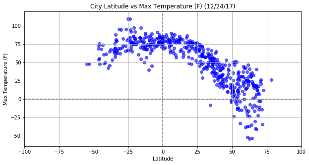
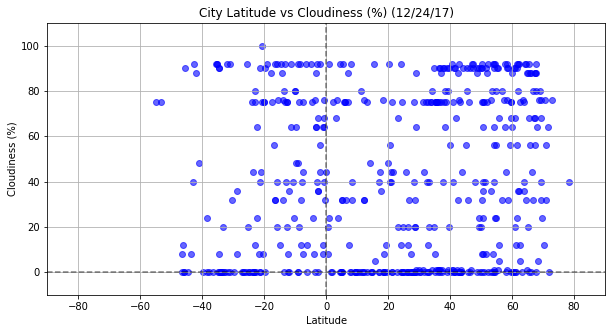

# WeatherPy

Date : 12/23/2017

Whether financial, political, or social -- data's true power lies in its ability to answer questions definitively. 

The Analysis consists in visualizing the weather of randomly selected 500+ cities across the world of varying distance from the equator and creating a representative model of weather across world cities.

The goal is to build a series of scatter plots to showcase the following relationships:

Temperature (F) vs. Latitude
Humidity (%) vs. Latitude
Cloudiness (%) vs. Latitude
Wind Speed (mph) vs. Latitude

The  HW_WeatherPy.ipbn notebook includes:

### The Following Dependencies
import numpy as np
import pandas as pd
import matplotlib.pyplot as plt
import requests as req
import time
from datetime import datetime

import openweathermapy.core as ow
from citipy import citipy

### CALL THE FOLLOWING FUNCTIONS: 

1) coordinates_func():
2) first_upper(s):
3) get_file_contents(filename):
4) convert_date(day):
5) set_plot_labels(x_title, y_title, day, x_limit , y_limit, savefig):

### Perform API Calls

Perform a weather check on each of the cities using a series of successive API calls.

## PLOTTING THE RESULTS

### Latitude vs Temperature Plot

### Longitude vs Temperature Plot

### Humidity (%) vs. Latitude

### Cloudiness (%) vs. Latitude

### Wind Speed (mph) vs. Latitude

