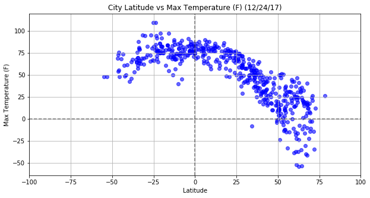
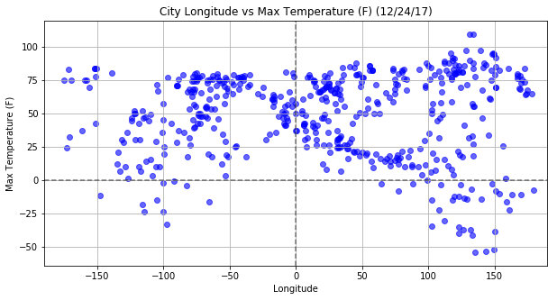
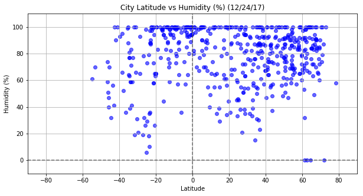
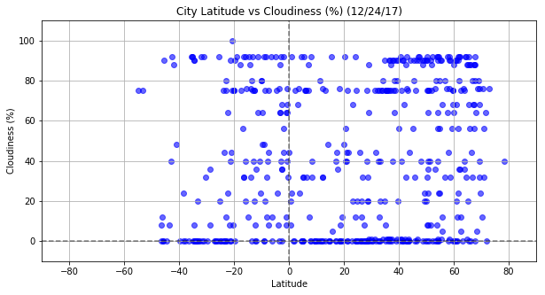
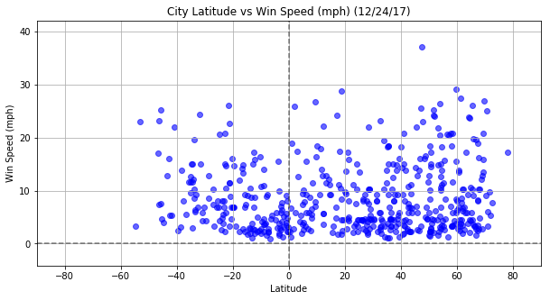

# WeatherPy

Whether financial, political, or social -- data's true power lies in its ability to answer questions definitively. 

The Analysis consists in visualizing the weather of 500+ cities across the world of varying distance from the equator and 
creating a representative model of weather across world cities.


```python
# Dependencies
import numpy as np
import pandas as pd
import matplotlib.pyplot as plt
import requests as req
import time
from datetime import datetime

import openweathermapy.core as ow
from citipy import citipy

```

### FUNCTIONS SECTION


```python
# Return coordinates of latitude and longitude 

def coordinates_func():
    # values should be between -90, 90  and -180, 180 
    return np.random.uniform(-92, 92), np.random.uniform(-182,182) 

```


```python
# Change First character of string to uppercase

def first_upper(s):
   if len(s) == 0:
      return s
   else:
      return s[0].upper() + s[1:]

```


```python
# Given a filename , return the contents of that file

def get_file_contents(filename):
    try:
        with open(filename, 'r') as f:
            # It's assumed our file contains a single line, with our API key
            return f.read().strip()
    except FileNotFoundError:
        print("'%s' file not found" % filename)
```


```python
# Convert DATE in string format '%Y-%m-%d %H:%M:%S' to "%m/%d/%Y" or '%x'local format (US format)

def convert_date(day):
    
    day_str = datetime.strptime(str(day), '%Y-%m-%d %H:%M:%S')
    
    return(datetime.strftime(day_str, "%x"))
   
```


```python
# The function is used for adding labels, getting the limits and saving the figure.

def set_plot_labels(x_title, y_title, day, x_limit , y_limit, savefig):
    
    # Add labels to the x and y axes
    
    title = "City "  +  x_title + " vs " + y_title + ' (' + day + ')'
    plt.title(title)
    plt.xlabel(x_title)    
    plt.ylabel(y_title)
    plt.grid(True)
    
    # Getting the limits
    plt.xlim(x_limit)
    plt.ylim(y_limit)
    plt.axvline(0, color='black', linestyle='dashed', alpha=0.5)
    plt.axhline(0, color='black', linestyle='dashed', alpha=0.5)
    figure_name="charts/WeatherPy_" + savefig + ".png"
    plt.savefig(figure_name)

```

### Generate Cities List

Randomly select at least 1000 unique (non-repeat) cities based on latitude and longitude.


```python
# Create a dataframe that randomly hold latitude, longitude, Near city, Near country

cities_df = pd.DataFrame()
cities_df['Near Latitude'] = " "
cities_df['Near Longitude'] = " "
cities_df['Near City'] = " "
cities_df['Country Code'] = " "

for x in range(3000):
    
    # Call coordinates function to generate randomly a pair of latitude, longitude
    lat_long = coordinates_func() 
    lat, long = lat_long
    
    # Get the city and the country code
    city= citipy.nearest_city(lat, long)
    cityname = first_upper(city.city_name)
    country = city.country_code.upper()
    
    # Fill up the Dataframe    
    cities_df.set_value(x,"Near Latitude",lat)
    cities_df.set_value(x,"Near Longitude",long)
    cities_df.set_value(x,"Near City",cityname)
    cities_df.set_value(x,"Country Code",country)
    
cities_df.describe()

```


<div>
<style>
    .dataframe thead tr:only-child th {
        text-align: right;
    }

    .dataframe thead th {
        text-align: left;
    }

    .dataframe tbody tr th {
        vertical-align: top;
    }
</style>
<table border="1" class="dataframe">
  <thead>
    <tr style="text-align: right;">
      <th></th>
      <th>Near Latitude</th>
      <th>Near Longitude</th>
      <th>Near City</th>
      <th>Country Code</th>
    </tr>
  </thead>
  <tbody>
    <tr>
      <th>count</th>
      <td>3000.000000</td>
      <td>3000.000000</td>
      <td>3000</td>
      <td>3000</td>
    </tr>
    <tr>
      <th>unique</th>
      <td>3000.000000</td>
      <td>3000.000000</td>
      <td>975</td>
      <td>141</td>
    </tr>
    <tr>
      <th>top</th>
      <td>-1.444792</td>
      <td>-1.574173</td>
      <td>Rikitea</td>
      <td>RU</td>
    </tr>
    <tr>
      <th>freq</th>
      <td>1.000000</td>
      <td>1.000000</td>
      <td>101</td>
      <td>363</td>
    </tr>
  </tbody>
</table>
</div>


### Cleaning cities data

Finding how many duplicates cities are in the dataframe cities.df and  removing them with keeping only one ocurrence. 


```python
cities_df.duplicated(subset=['Near City', 'Country Code']).sum()

cities_df.loc[cities_df.duplicated(subset=['Near City', 'Country Code'])].head()

```


<div>
<style>
    .dataframe thead tr:only-child th {
        text-align: right;
    }

    .dataframe thead th {
        text-align: left;
    }

    .dataframe tbody tr th {
        vertical-align: top;
    }
</style>
<table border="1" class="dataframe">
  <thead>
    <tr style="text-align: right;">
      <th></th>
      <th>Near Latitude</th>
      <th>Near Longitude</th>
      <th>Near City</th>
      <th>Country Code</th>
    </tr>
  </thead>
  <tbody>
    <tr>
      <th>6</th>
      <td>-69.0129</td>
      <td>-33.1949</td>
      <td>Ushuaia</td>
      <td>AR</td>
    </tr>
    <tr>
      <th>7</th>
      <td>-76.6333</td>
      <td>-31.7227</td>
      <td>Ushuaia</td>
      <td>AR</td>
    </tr>
    <tr>
      <th>10</th>
      <td>65.4608</td>
      <td>-53.5163</td>
      <td>Maniitsoq</td>
      <td>GL</td>
    </tr>
    <tr>
      <th>26</th>
      <td>-52.9714</td>
      <td>89.5291</td>
      <td>Busselton</td>
      <td>AU</td>
    </tr>
    <tr>
      <th>35</th>
      <td>-13.8431</td>
      <td>-134.573</td>
      <td>Atuona</td>
      <td>PF</td>
    </tr>
  </tbody>
</table>
</div>


```python
# Drop duplicate rows in cities_df except for the first ocurrence.

cities_df.drop_duplicates(subset=['Near City', 'Country Code'], keep="first", inplace=True)
cities_df.head()

```


<div>
<style>
    .dataframe thead tr:only-child th {
        text-align: right;
    }

    .dataframe thead th {
        text-align: left;
    }

    .dataframe tbody tr th {
        vertical-align: top;
    }
</style>
<table border="1" class="dataframe">
  <thead>
    <tr style="text-align: right;">
      <th></th>
      <th>Near Latitude</th>
      <th>Near Longitude</th>
      <th>Near City</th>
      <th>Country Code</th>
    </tr>
  </thead>
  <tbody>
    <tr>
      <th>0</th>
      <td>64.3853</td>
      <td>-56.4764</td>
      <td>Maniitsoq</td>
      <td>GL</td>
    </tr>
    <tr>
      <th>1</th>
      <td>13.9357</td>
      <td>-128.04</td>
      <td>Constitucion</td>
      <td>MX</td>
    </tr>
    <tr>
      <th>2</th>
      <td>-90.1516</td>
      <td>-58.6476</td>
      <td>Ushuaia</td>
      <td>AR</td>
    </tr>
    <tr>
      <th>3</th>
      <td>88.6109</td>
      <td>-49.2814</td>
      <td>Upernavik</td>
      <td>GL</td>
    </tr>
    <tr>
      <th>4</th>
      <td>72.527</td>
      <td>50.4174</td>
      <td>Belushya guba</td>
      <td>RU</td>
    </tr>
  </tbody>
</table>
</div>


```python
cities_df.describe()
```


<div>
<style>
    .dataframe thead tr:only-child th {
        text-align: right;
    }

    .dataframe thead th {
        text-align: left;
    }

    .dataframe tbody tr th {
        vertical-align: top;
    }
</style>
<table border="1" class="dataframe">
  <thead>
    <tr style="text-align: right;">
      <th></th>
      <th>Near Latitude</th>
      <th>Near Longitude</th>
      <th>Near City</th>
      <th>Country Code</th>
    </tr>
  </thead>
  <tbody>
    <tr>
      <th>count</th>
      <td>983.000000</td>
      <td>983.000000</td>
      <td>983</td>
      <td>983</td>
    </tr>
    <tr>
      <th>unique</th>
      <td>983.000000</td>
      <td>983.000000</td>
      <td>975</td>
      <td>141</td>
    </tr>
    <tr>
      <th>top</th>
      <td>-1.574983</td>
      <td>-1.788272</td>
      <td>Jamestown</td>
      <td>RU</td>
    </tr>
    <tr>
      <th>freq</th>
      <td>1.000000</td>
      <td>1.000000</td>
      <td>2</td>
      <td>139</td>
    </tr>
  </tbody>
</table>
</div>


```python
sample_cities_df= cities_df.sample(600)
sample_cities_df.head()
```


<div>
<style>
    .dataframe thead tr:only-child th {
        text-align: right;
    }

    .dataframe thead th {
        text-align: left;
    }

    .dataframe tbody tr th {
        vertical-align: top;
    }
</style>
<table border="1" class="dataframe">
  <thead>
    <tr style="text-align: right;">
      <th></th>
      <th>Near Latitude</th>
      <th>Near Longitude</th>
      <th>Near City</th>
      <th>Country Code</th>
    </tr>
  </thead>
  <tbody>
    <tr>
      <th>178</th>
      <td>33.0542</td>
      <td>20.6515</td>
      <td>Tukrah</td>
      <td>LY</td>
    </tr>
    <tr>
      <th>2607</th>
      <td>58.8081</td>
      <td>77.0471</td>
      <td>Strezhevoy</td>
      <td>RU</td>
    </tr>
    <tr>
      <th>2795</th>
      <td>-32.1716</td>
      <td>-59.7097</td>
      <td>Victoria</td>
      <td>AR</td>
    </tr>
    <tr>
      <th>64</th>
      <td>47.4417</td>
      <td>-106.298</td>
      <td>Miles city</td>
      <td>US</td>
    </tr>
    <tr>
      <th>199</th>
      <td>16.479</td>
      <td>83.6145</td>
      <td>Yarada</td>
      <td>IN</td>
    </tr>
  </tbody>
</table>
</div>


### Perform API Calls

Perform a weather check on each of the cities using a series of successive API calls.


```python
# Save config information.
filename = 'apikey'

base_url = "http://api.openweathermap.org/data/2.5/weather?"
units = "imperial"

api_key = get_file_contents(filename)

```


```python
set_1 = 1
count_citi= 0
weather_data = []

print("Beginning Data Retrieval")
print("-------------------------------------------------------------------------------------")

for index, row in sample_cities_df.iterrows():
      
    city= sample_cities_df.loc[index]["Near City"]
    country=sample_cities_df.loc[index]["Country Code"]
    
    count_citi+=1
    
    if (count_citi == 1):
        start_time = time.process_time()
        
    params = city + "," + country
    print("Processing Record " +  str(count_citi) +  " of Set "  + str(set_1) + " | "  + params )
    query_url = base_url + "appid=" + api_key + "&units=" + units + "&q="

    try:
        weather_response = req.get(query_url + params).json()
                
        if (weather_response.get("cod") == 200):
            weather_data.append(weather_response)
        else:
            print("City " + city + " not found")
    except:
        print ("I got an error")
        continue
   
    # Avoid locking 
    if ( count_citi == 60):
        set_1 += 1
        count_citi = 0
        end_time = time.process_time()
        processing_time = end_time - start_time
        print("Processed 60 countries in :  " + str(processing_time))
        time.sleep(30)

# Extract data from weather_data responses
city_data = [data.get("name") for data in weather_data]
country_data = [data.get("sys").get("country") for data in weather_data]
lat_data = [data.get("coord").get("lat") for data in weather_data]
lon_data = [data.get("coord").get("lon") for data in weather_data]
temp_data = [data.get("main").get("temp_max") for data in weather_data]
humidity_data = [data.get("main").get("humidity") for data in weather_data]
clouds_data = [data.get("clouds").get("all") for data in weather_data]
wind_data = [data.get("wind").get("speed") for data in weather_data]
date_data = [data.get("dt") for data in weather_data]

weather_data = {"City": city_data, "Country": country_data, "Latitude": lat_data, "Longitude": lon_data,
                "Max Temp (F)": temp_data, "Humidity (%)": humidity_data, "Cloudiness (%)": clouds_data, 
                "Win Speed (mph)": wind_data, "Date": date_data}

weather_data = pd.DataFrame(weather_data)
 
```

    Beginning Data Retrieval
    -------------------------------------------------------------------------------------
    Processing Record 1 of Set 1 | Tukrah,LY
    City Tukrah not found
    Processing Record 2 of Set 1 | Strezhevoy,RU
    Processing Record 3 of Set 1 | Victoria,AR
    Processing Record 4 of Set 1 | Miles city,US
    Processing Record 5 of Set 1 | Yarada,IN
    Processing Record 6 of Set 1 | Lima,PE
    Processing Record 7 of Set 1 | Emba,KZ
    City Emba not found
    Processing Record 8 of Set 1 | Sidi ali,DZ
    Processing Record 9 of Set 1 | Hvammstangi,IS
    City Hvammstangi not found
    Processing Record 10 of Set 1 | Pevek,RU
    Processing Record 11 of Set 1 | Marrakesh,MA
    Processing Record 12 of Set 1 | Rampura,IN
    Processing Record 13 of Set 1 | Ankang,CN
    Processing Record 14 of Set 1 | Biak,ID
    Processing Record 15 of Set 1 | The valley,AI
    Processing Record 16 of Set 1 | Atar,MR
    Processing Record 17 of Set 1 | Ruatoria,NZ
    City Ruatoria not found
    Processing Record 18 of Set 1 | Colares,PT
    Processing Record 19 of Set 1 | Kotelnich,RU
    Processing Record 20 of Set 1 | Dondo,MZ
    Processing Record 21 of Set 1 | Pinega,RU
    Processing Record 22 of Set 1 | Hadgaon,IN
    Processing Record 23 of Set 1 | Venafro,IT
    Processing Record 24 of Set 1 | Berdigestyakh,RU
    Processing Record 25 of Set 1 | Busselton,AU
    Processing Record 26 of Set 1 | Waddan,LY
    Processing Record 27 of Set 1 | Bhan,PK
    Processing Record 28 of Set 1 | Pangnirtung,CA
    Processing Record 29 of Set 1 | Suoyarvi,RU
    Processing Record 30 of Set 1 | Birjand,IR
    Processing Record 31 of Set 1 | Nur,IR
    City Nur not found
    Processing Record 32 of Set 1 | Hermanus,ZA
    Processing Record 33 of Set 1 | Alta floresta,BR
    Processing Record 34 of Set 1 | Alappuzha,IN
    City Alappuzha not found
    Processing Record 35 of Set 1 | Bolungarvik,IS
    City Bolungarvik not found
    Processing Record 36 of Set 1 | Mys shmidta,RU
    City Mys shmidta not found
    Processing Record 37 of Set 1 | Fare,PF
    Processing Record 38 of Set 1 | Chara,RU
    Processing Record 39 of Set 1 | Svetlyy,RU
    City Svetlyy not found
    Processing Record 40 of Set 1 | Fuerte olimpo,PY
    Processing Record 41 of Set 1 | Atuona,PF
    Processing Record 42 of Set 1 | Luganville,VU
    Processing Record 43 of Set 1 | Srednekolymsk,RU
    Processing Record 44 of Set 1 | Kaeo,NZ
    Processing Record 45 of Set 1 | Inhambane,MZ
    Processing Record 46 of Set 1 | Chuy,UY
    Processing Record 47 of Set 1 | Simbahan,PH
    Processing Record 48 of Set 1 | Dibulla,CO
    Processing Record 49 of Set 1 | Karaul,RU
    City Karaul not found
    Processing Record 50 of Set 1 | Papara,PF
    City Papara not found
    Processing Record 51 of Set 1 | Punta arenas,CL
    Processing Record 52 of Set 1 | Stornoway,GB
    Processing Record 53 of Set 1 | Bac lieu,VN
    City Bac lieu not found
    Processing Record 54 of Set 1 | Kamenka,RU
    Processing Record 55 of Set 1 | Mildura,AU
    Processing Record 56 of Set 1 | Borgosesia,IT
    Processing Record 57 of Set 1 | Nador,MA
    Processing Record 58 of Set 1 | Bustamante,MX
    Processing Record 59 of Set 1 | Kirovsk,RU
    Processing Record 60 of Set 1 | Labuhan,ID
    Processed 60 countries in :  0.75
    Processing Record 1 of Set 2 | Yuancheng,CN
    Processing Record 2 of Set 2 | Oum hadjer,TD
    Processing Record 3 of Set 2 | Vagur,FO
    Processing Record 4 of Set 2 | Sinnamary,GF
    Processing Record 5 of Set 2 | El balyana,EG
    City El balyana not found
    Processing Record 6 of Set 2 | Dzaoudzi,YT
    Processing Record 7 of Set 2 | Axim,GH
    Processing Record 8 of Set 2 | Nicoya,CR
    Processing Record 9 of Set 2 | Sao gabriel da cachoeira,BR
    Processing Record 10 of Set 2 | Hofn,IS
    Processing Record 11 of Set 2 | Talnakh,RU
    Processing Record 12 of Set 2 | Serabu,SL
    Processing Record 13 of Set 2 | Aktash,RU
    Processing Record 14 of Set 2 | Caravelas,BR
    Processing Record 15 of Set 2 | Sanming,CN
    Processing Record 16 of Set 2 | Shiyan,CN
    Processing Record 17 of Set 2 | Hasaki,JP
    Processing Record 18 of Set 2 | Dunedin,NZ
    Processing Record 19 of Set 2 | Sarwar,IN
    Processing Record 20 of Set 2 | Gazli,UZ
    Processing Record 21 of Set 2 | Sicamous,CA
    Processing Record 22 of Set 2 | Kaiyuan,CN
    Processing Record 23 of Set 2 | Tasbuget,KZ
    City Tasbuget not found
    Processing Record 24 of Set 2 | Varena,LT
    Processing Record 25 of Set 2 | Bur gabo,SO
    City Bur gabo not found
    Processing Record 26 of Set 2 | San quintin,MX
    City San quintin not found
    Processing Record 27 of Set 2 | Kungurtug,RU
    Processing Record 28 of Set 2 | Fort portal,UG
    Processing Record 29 of Set 2 | Wanning,CN
    Processing Record 30 of Set 2 | Xinglongshan,CN
    Processing Record 31 of Set 2 | Beba,EG
    City Beba not found
    Processing Record 32 of Set 2 | Lalomanu,WS
    City Lalomanu not found
    Processing Record 33 of Set 2 | Lishan,CN
    Processing Record 34 of Set 2 | Zavyalovo,RU
    Processing Record 35 of Set 2 | Porterville,US
    Processing Record 36 of Set 2 | Saint george,BM
    Processing Record 37 of Set 2 | Tottori,JP
    Processing Record 38 of Set 2 | Vila franca do campo,PT
    Processing Record 39 of Set 2 | Richards bay,ZA
    Processing Record 40 of Set 2 | Ancud,CL
    Processing Record 41 of Set 2 | Sorata,BO
    Processing Record 42 of Set 2 | Faanui,PF
    Processing Record 43 of Set 2 | Kapuskasing,CA
    Processing Record 44 of Set 2 | Krasnoborsk,RU
    Processing Record 45 of Set 2 | Dakar,SN
    Processing Record 46 of Set 2 | Tongliao,CN
    Processing Record 47 of Set 2 | Komsomolskiy,RU
    Processing Record 48 of Set 2 | Tazovskiy,RU
    Processing Record 49 of Set 2 | Leh,IN
    Processing Record 50 of Set 2 | Sambava,MG
    Processing Record 51 of Set 2 | Kot samaba,PK
    Processing Record 52 of Set 2 | Kalga,RU
    Processing Record 53 of Set 2 | Andreapol,RU
    Processing Record 54 of Set 2 | Virginia beach,US
    Processing Record 55 of Set 2 | Tar,HU
    Processing Record 56 of Set 2 | Lalin,ES
    Processing Record 57 of Set 2 | Bethel,US
    Processing Record 58 of Set 2 | Manzhouli,CN
    Processing Record 59 of Set 2 | Chama,ZM
    Processing Record 60 of Set 2 | Andapa,MG
    Processed 60 countries in :  0.703125
    Processing Record 1 of Set 3 | Yellowknife,CA
    Processing Record 2 of Set 3 | Zhigansk,RU
    Processing Record 3 of Set 3 | El alto,PE
    City El alto not found
    Processing Record 4 of Set 3 | Roald,NO
    Processing Record 5 of Set 3 | Moerai,PF
    Processing Record 6 of Set 3 | Ngunguru,NZ
    Processing Record 7 of Set 3 | Maltahohe,NA
    Processing Record 8 of Set 3 | Dingle,IE
    Processing Record 9 of Set 3 | Gusino,RU
    Processing Record 10 of Set 3 | San policarpo,PH
    Processing Record 11 of Set 3 | Dauphin,CA
    Processing Record 12 of Set 3 | Yambio,SD
    City Yambio not found
    Processing Record 13 of Set 3 | Santa rosa,AR
    Processing Record 14 of Set 3 | Pisco,PE
    Processing Record 15 of Set 3 | Comodoro rivadavia,AR
    Processing Record 16 of Set 3 | Kondinskoye,RU
    Processing Record 17 of Set 3 | Standerton,ZA
    Processing Record 18 of Set 3 | At-bashi,KG
    Processing Record 19 of Set 3 | Sisimiut,GL
    Processing Record 20 of Set 3 | Panguipulli,CL
    Processing Record 21 of Set 3 | Currais novos,BR
    Processing Record 22 of Set 3 | San miguel de cauri,PE
    Processing Record 23 of Set 3 | Hanzhong,CN
    Processing Record 24 of Set 3 | Afmadu,SO
    City Afmadu not found
    Processing Record 25 of Set 3 | Zambezi,ZM
    Processing Record 26 of Set 3 | Vaitape,PF
    Processing Record 27 of Set 3 | San patricio,MX
    Processing Record 28 of Set 3 | Portland,AU
    Processing Record 29 of Set 3 | Bombay,IN
    City Bombay not found
    Processing Record 30 of Set 3 | Puerto ayora,EC
    Processing Record 31 of Set 3 | Alofi,NU
    Processing Record 32 of Set 3 | Mahajanga,MG
    Processing Record 33 of Set 3 | Laguna,BR
    City Laguna not found
    Processing Record 34 of Set 3 | Taganak,PH
    Processing Record 35 of Set 3 | Statesville,US
    Processing Record 36 of Set 3 | Soledad,US
    Processing Record 37 of Set 3 | Port hardy,CA
    Processing Record 38 of Set 3 | Saint-joseph,RE
    Processing Record 39 of Set 3 | Pampa,US
    Processing Record 40 of Set 3 | Harper,LR
    Processing Record 41 of Set 3 | Asau,TV
    City Asau not found
    Processing Record 42 of Set 3 | Waw,SD
    City Waw not found
    Processing Record 43 of Set 3 | Chimbote,PE
    Processing Record 44 of Set 3 | Rio claro,BR
    Processing Record 45 of Set 3 | Grand-lahou,CI
    Processing Record 46 of Set 3 | Lorengau,PG
    Processing Record 47 of Set 3 | Naryan-mar,RU
    Processing Record 48 of Set 3 | Udachnyy,RU
    Processing Record 49 of Set 3 | Bandarbeyla,SO
    Processing Record 50 of Set 3 | Vardo,NO
    Processing Record 51 of Set 3 | Santiago de chuco,PE
    Processing Record 52 of Set 3 | Tahe,CN
    Processing Record 53 of Set 3 | Carnarvon,AU
    Processing Record 54 of Set 3 | Ushuaia,AR
    Processing Record 55 of Set 3 | Verkhnyaya inta,RU
    Processing Record 56 of Set 3 | Darhan,MN
    Processing Record 57 of Set 3 | Camacha,PT
    Processing Record 58 of Set 3 | Moate,IE
    Processing Record 59 of Set 3 | Lasa,CN
    City Lasa not found
    Processing Record 60 of Set 3 | Havelock,US
    Processed 60 countries in :  0.796875
    Processing Record 1 of Set 4 | Viligili,MV
    City Viligili not found
    Processing Record 2 of Set 4 | Curaca,BR
    Processing Record 3 of Set 4 | Howard springs,AU
    Processing Record 4 of Set 4 | Manokwari,ID
    Processing Record 5 of Set 4 | Katsuura,JP
    Processing Record 6 of Set 4 | Mogadishu,SO
    Processing Record 7 of Set 4 | Sirur,IN
    Processing Record 8 of Set 4 | Arman,RU
    Processing Record 9 of Set 4 | Tazmalt,DZ
    Processing Record 10 of Set 4 | Tunduru,TZ
    City Tunduru not found
    Processing Record 11 of Set 4 | Itacoatiara,BR
    Processing Record 12 of Set 4 | Ostrovnoy,RU
    Processing Record 13 of Set 4 | Morros,BR
    Processing Record 14 of Set 4 | Mayumba,GA
    Processing Record 15 of Set 4 | Mouzouras,GR
    Processing Record 16 of Set 4 | High rock,BS
    Processing Record 17 of Set 4 | Tsihombe,MG
    City Tsihombe not found
    Processing Record 18 of Set 4 | Half moon bay,US
    Processing Record 19 of Set 4 | Zemio,CF
    Processing Record 20 of Set 4 | Cockburn town,TC
    Processing Record 21 of Set 4 | Alexandria,EG
    Processing Record 22 of Set 4 | Novaya malykla,RU
    Processing Record 23 of Set 4 | Ust-ishim,RU
    Processing Record 24 of Set 4 | San jose,GT
    Processing Record 25 of Set 4 | Nemuro,JP
    Processing Record 26 of Set 4 | Edgewater,US
    Processing Record 27 of Set 4 | Zeya,RU
    Processing Record 28 of Set 4 | Longyearbyen,SJ
    Processing Record 29 of Set 4 | Ishigaki,JP
    Processing Record 30 of Set 4 | Avarua,CK
    Processing Record 31 of Set 4 | Borovskoy,KZ
    Processing Record 32 of Set 4 | Lucapa,AO
    Processing Record 33 of Set 4 | Cherskiy,RU
    Processing Record 34 of Set 4 | Tillabery,NE
    City Tillabery not found
    Processing Record 35 of Set 4 | Kahului,US
    Processing Record 36 of Set 4 | Benguela,AO
    Processing Record 37 of Set 4 | Tolaga bay,NZ
    Processing Record 38 of Set 4 | Severobaykalsk,RU
    Processing Record 39 of Set 4 | Provideniya,RU
    Processing Record 40 of Set 4 | Havre,US
    Processing Record 41 of Set 4 | Faya,TD
    City Faya not found
    Processing Record 42 of Set 4 | Sakaiminato,JP
    Processing Record 43 of Set 4 | Marsh harbour,BS
    Processing Record 44 of Set 4 | Kattivakkam,IN
    Processing Record 45 of Set 4 | Tuktoyaktuk,CA
    Processing Record 46 of Set 4 | Bouna,CI
    Processing Record 47 of Set 4 | Butaritari,KI
    Processing Record 48 of Set 4 | Mount gambier,AU
    Processing Record 49 of Set 4 | Saravena,CO
    Processing Record 50 of Set 4 | Tabiauea,KI
    City Tabiauea not found
    Processing Record 51 of Set 4 | Vestmannaeyjar,IS
    Processing Record 52 of Set 4 | Kropotkin,RU
    Processing Record 53 of Set 4 | Ciras,AF
    City Ciras not found
    Processing Record 54 of Set 4 | Sibu,MY
    Processing Record 55 of Set 4 | Nikolskoye,RU
    Processing Record 56 of Set 4 | Mizdah,LY
    Processing Record 57 of Set 4 | Daru,PG
    Processing Record 58 of Set 4 | Saleaula,WS
    City Saleaula not found
    Processing Record 59 of Set 4 | Pokrovsk-uralskiy,RU
    City Pokrovsk-uralskiy not found
    Processing Record 60 of Set 4 | Kitimat,CA
    Processed 60 countries in :  0.703125
    Processing Record 1 of Set 5 | Fomboni,KM
    Processing Record 2 of Set 5 | La ronge,CA
    Processing Record 3 of Set 5 | Pilar,PH
    Processing Record 4 of Set 5 | Yirol,SD
    City Yirol not found
    Processing Record 5 of Set 5 | Petropavlovsk-kamchatskiy,RU
    Processing Record 6 of Set 5 | Chambar,PK
    City Chambar not found
    Processing Record 7 of Set 5 | Homer,US
    Processing Record 8 of Set 5 | Finschhafen,PG
    Processing Record 9 of Set 5 | Vanimo,PG
    Processing Record 10 of Set 5 | High level,CA
    Processing Record 11 of Set 5 | Rungata,KI
    City Rungata not found
    Processing Record 12 of Set 5 | Anar darreh,AF
    City Anar darreh not found
    Processing Record 13 of Set 5 | Alugan,PH
    Processing Record 14 of Set 5 | Vigrestad,NO
    Processing Record 15 of Set 5 | Preobrazheniye,RU
    Processing Record 16 of Set 5 | Madimba,TZ
    Processing Record 17 of Set 5 | Ust-kamchatsk,RU
    City Ust-kamchatsk not found
    Processing Record 18 of Set 5 | Souillac,MU
    Processing Record 19 of Set 5 | Goderich,SL
    City Goderich not found
    Processing Record 20 of Set 5 | Kalmunai,LK
    Processing Record 21 of Set 5 | Esperance,AU
    Processing Record 22 of Set 5 | Avera,PF
    City Avera not found
    Processing Record 23 of Set 5 | Tokur,RU
    Processing Record 24 of Set 5 | Lethem,GY
    Processing Record 25 of Set 5 | Juneau,US
    Processing Record 26 of Set 5 | Port blair,IN
    Processing Record 27 of Set 5 | Havre-saint-pierre,CA
    Processing Record 28 of Set 5 | Lexington,US
    Processing Record 29 of Set 5 | Rio grande,BR
    Processing Record 30 of Set 5 | Yanan,CN
    City Yanan not found
    Processing Record 31 of Set 5 | Warka,PL
    Processing Record 32 of Set 5 | Jaffna,LK
    Processing Record 33 of Set 5 | Andros town,BS
    Processing Record 34 of Set 5 | Tacoronte,ES
    Processing Record 35 of Set 5 | Guerrero negro,MX
    Processing Record 36 of Set 5 | Twentynine palms,US
    Processing Record 37 of Set 5 | New norfolk,AU
    Processing Record 38 of Set 5 | Prieska,ZA
    Processing Record 39 of Set 5 | Coahuayana,MX
    Processing Record 40 of Set 5 | Cosala,MX
    City Cosala not found
    Processing Record 41 of Set 5 | Bacum,MX
    Processing Record 42 of Set 5 | Pafos,CY
    City Pafos not found
    Processing Record 43 of Set 5 | Las vegas,US
    Processing Record 44 of Set 5 | Oltu,TR
    Processing Record 45 of Set 5 | Naze,JP
    Processing Record 46 of Set 5 | Mataura,PF
    City Mataura not found
    Processing Record 47 of Set 5 | Pacific grove,US
    Processing Record 48 of Set 5 | Hays,US
    Processing Record 49 of Set 5 | Yaan,CN
    City Yaan not found
    Processing Record 50 of Set 5 | Pramanta,GR
    Processing Record 51 of Set 5 | Wulanhaote,CN
    City Wulanhaote not found
    Processing Record 52 of Set 5 | Paradwip,IN
    City Paradwip not found
    Processing Record 53 of Set 5 | Aswan,EG
    Processing Record 54 of Set 5 | Tasiilaq,GL
    Processing Record 55 of Set 5 | Upernavik,GL
    Processing Record 56 of Set 5 | Daultala,PK
    Processing Record 57 of Set 5 | Isangel,VU
    Processing Record 58 of Set 5 | Vangaindrano,MG
    Processing Record 59 of Set 5 | Korla,CN
    Processing Record 60 of Set 5 | Sioux lookout,CA
    Processed 60 countries in :  0.625
    Processing Record 1 of Set 6 | Bengkulu,ID
    City Bengkulu not found
    Processing Record 2 of Set 6 | Eskil,TR
    Processing Record 3 of Set 6 | Camana,PE
    City Camana not found
    Processing Record 4 of Set 6 | Contamana,PE
    Processing Record 5 of Set 6 | Bonavista,CA
    Processing Record 6 of Set 6 | San vicente,PH
    Processing Record 7 of Set 6 | Byron bay,AU
    Processing Record 8 of Set 6 | Dwarka,IN
    Processing Record 9 of Set 6 | Kavieng,PG
    Processing Record 10 of Set 6 | Barcelos,BR
    Processing Record 11 of Set 6 | Meadow lake,CA
    Processing Record 12 of Set 6 | Erzin,RU
    Processing Record 13 of Set 6 | Dodoma,TZ
    Processing Record 14 of Set 6 | Niquero,CU
    Processing Record 15 of Set 6 | Kloulklubed,PW
    Processing Record 16 of Set 6 | Ust-omchug,RU
    Processing Record 17 of Set 6 | Doha,KW
    City Doha not found
    Processing Record 18 of Set 6 | Bulgan,MN
    Processing Record 19 of Set 6 | Cap-aux-meules,CA
    Processing Record 20 of Set 6 | Ayan,RU
    City Ayan not found
    Processing Record 21 of Set 6 | Draguignan,FR
    Processing Record 22 of Set 6 | Sitka,US
    Processing Record 23 of Set 6 | Winnemucca,US
    Processing Record 24 of Set 6 | Adrar,DZ
    Processing Record 25 of Set 6 | Maarianhamina,FI
    City Maarianhamina not found
    Processing Record 26 of Set 6 | Boissevain,CA
    Processing Record 27 of Set 6 | Santa fe,CU
    Processing Record 28 of Set 6 | Narrabri,AU
    Processing Record 29 of Set 6 | Dickinson,US
    Processing Record 30 of Set 6 | Kansanshi,ZM
    Processing Record 31 of Set 6 | Gorom-gorom,BF
    Processing Record 32 of Set 6 | Saint-louis,RE
    Processing Record 33 of Set 6 | Kegayli,UZ
    City Kegayli not found
    Processing Record 34 of Set 6 | Grindavik,IS
    Processing Record 35 of Set 6 | Sept-iles,CA
    Processing Record 36 of Set 6 | Norman wells,CA
    Processing Record 37 of Set 6 | Alice springs,AU
    Processing Record 38 of Set 6 | Nanded,IN
    City Nanded not found
    Processing Record 39 of Set 6 | Pitimbu,BR
    Processing Record 40 of Set 6 | Porto novo,CV
    Processing Record 41 of Set 6 | Rawatsar,IN
    Processing Record 42 of Set 6 | Atbasar,KZ
    Processing Record 43 of Set 6 | Albany,AU
    Processing Record 44 of Set 6 | Besancon,FR
    Processing Record 45 of Set 6 | Margate,ZA
    Processing Record 46 of Set 6 | Klamath falls,US
    Processing Record 47 of Set 6 | Ketchikan,US
    Processing Record 48 of Set 6 | Port hedland,AU
    Processing Record 49 of Set 6 | Iranshahr,IR
    Processing Record 50 of Set 6 | Yumen,CN
    Processing Record 51 of Set 6 | Nguiu,AU
    City Nguiu not found
    Processing Record 52 of Set 6 | Chilca,PE
    Processing Record 53 of Set 6 | Porto nacional,BR
    Processing Record 54 of Set 6 | Ahipara,NZ
    Processing Record 55 of Set 6 | Vryburg,ZA
    Processing Record 56 of Set 6 | Nouadhibou,MR
    Processing Record 57 of Set 6 | Ouadda,CF
    Processing Record 58 of Set 6 | Grand gaube,MU
    Processing Record 59 of Set 6 | Selishche,RU
    City Selishche not found
    Processing Record 60 of Set 6 | Amderma,RU
    City Amderma not found
    Processed 60 countries in :  0.8125
    Processing Record 1 of Set 7 | Saint andrews,CA
    Processing Record 2 of Set 7 | Kijang,ID
    Processing Record 3 of Set 7 | Palabuhanratu,ID
    City Palabuhanratu not found
    Processing Record 4 of Set 7 | Clarence town,BS
    Processing Record 5 of Set 7 | Sao joao da barra,BR
    Processing Record 6 of Set 7 | Northam,AU
    Processing Record 7 of Set 7 | Yeppoon,AU
    Processing Record 8 of Set 7 | Deputatskiy,RU
    Processing Record 9 of Set 7 | Marevo,RU
    Processing Record 10 of Set 7 | Olden,NO
    Processing Record 11 of Set 7 | Nanortalik,GL
    Processing Record 12 of Set 7 | Barrow,US
    Processing Record 13 of Set 7 | Spas-demensk,RU
    Processing Record 14 of Set 7 | Ribeira grande,PT
    Processing Record 15 of Set 7 | Yabrud,SY
    Processing Record 16 of Set 7 | Saint anthony,CA
    City Saint anthony not found
    Processing Record 17 of Set 7 | Waingapu,ID
    Processing Record 18 of Set 7 | Kautokeino,NO
    Processing Record 19 of Set 7 | Mar del plata,AR
    Processing Record 20 of Set 7 | Union city,US
    Processing Record 21 of Set 7 | Mmabatho,ZA
    Processing Record 22 of Set 7 | Luanda,AO
    Processing Record 23 of Set 7 | Ewa beach,US
    Processing Record 24 of Set 7 | Vaini,TO
    Processing Record 25 of Set 7 | Dalnerechensk,RU
    Processing Record 26 of Set 7 | Zyryanka,RU
    Processing Record 27 of Set 7 | Lata,SB
    City Lata not found
    Processing Record 28 of Set 7 | Dromolaxia,CY
    Processing Record 29 of Set 7 | Flinders,AU
    Processing Record 30 of Set 7 | Prainha,BR
    Processing Record 31 of Set 7 | Maragogi,BR
    Processing Record 32 of Set 7 | Sorland,NO
    Processing Record 33 of Set 7 | Gamba,GA
    Processing Record 34 of Set 7 | Acarau,BR
    City Acarau not found
    Processing Record 35 of Set 7 | Mrirt,MA
    City Mrirt not found
    Processing Record 36 of Set 7 | Port hawkesbury,CA
    Processing Record 37 of Set 7 | Vaitupu,WF
    City Vaitupu not found
    Processing Record 38 of Set 7 | Sorkjosen,NO
    City Sorkjosen not found
    Processing Record 39 of Set 7 | Kiama,AU
    Processing Record 40 of Set 7 | Guarapuava,BR
    Processing Record 41 of Set 7 | Nabire,ID
    Processing Record 42 of Set 7 | Aksu,CN
    Processing Record 43 of Set 7 | Auki,SB
    Processing Record 44 of Set 7 | Cape town,ZA
    Processing Record 45 of Set 7 | Cap malheureux,MU
    Processing Record 46 of Set 7 | Aqtobe,KZ
    Processing Record 47 of Set 7 | Victoria,SC
    Processing Record 48 of Set 7 | Tahoua,NE
    Processing Record 49 of Set 7 | Novoagansk,RU
    Processing Record 50 of Set 7 | Nha trang,VN
    Processing Record 51 of Set 7 | Bluff,NZ
    Processing Record 52 of Set 7 | Boyolangu,ID
    Processing Record 53 of Set 7 | Misterbianco,IT
    Processing Record 54 of Set 7 | Sao joao de pirabas,BR
    Processing Record 55 of Set 7 | Kiruna,SE
    Processing Record 56 of Set 7 | Kaitangata,NZ
    Processing Record 57 of Set 7 | Muros,ES
    Processing Record 58 of Set 7 | Arlit,NE
    Processing Record 59 of Set 7 | Boundiali,CI
    Processing Record 60 of Set 7 | Prince rupert,CA
    Processed 60 countries in :  0.703125
    Processing Record 1 of Set 8 | Khonuu,RU
    City Khonuu not found
    Processing Record 2 of Set 8 | San andres,CO
    Processing Record 3 of Set 8 | Christchurch,NZ
    Processing Record 4 of Set 8 | Qovlar,AZ
    Processing Record 5 of Set 8 | Coihaique,CL
    Processing Record 6 of Set 8 | Lagoa,PT
    Processing Record 7 of Set 8 | Tefe,BR
    Processing Record 8 of Set 8 | Linqiong,CN
    Processing Record 9 of Set 8 | Pitkyaranta,RU
    Processing Record 10 of Set 8 | Bhilai,IN
    Processing Record 11 of Set 8 | Arani,BO
    Processing Record 12 of Set 8 | Marystown,CA
    Processing Record 13 of Set 8 | Zhigalovo,RU
    Processing Record 14 of Set 8 | Leirvik,FO
    City Leirvik not found
    Processing Record 15 of Set 8 | Sakakah,SA
    City Sakakah not found
    Processing Record 16 of Set 8 | Erenhot,CN
    Processing Record 17 of Set 8 | Nome,US
    Processing Record 18 of Set 8 | Salym,RU
    Processing Record 19 of Set 8 | Ulaangom,MN
    Processing Record 20 of Set 8 | Boende,CD
    Processing Record 21 of Set 8 | Athabasca,CA
    Processing Record 22 of Set 8 | Majene,ID
    Processing Record 23 of Set 8 | Rocha,UY
    Processing Record 24 of Set 8 | Honningsvag,NO
    Processing Record 25 of Set 8 | Zrece,SI
    Processing Record 26 of Set 8 | Odoyev,RU
    Processing Record 27 of Set 8 | Emerald,AU
    Processing Record 28 of Set 8 | Grez-doiceau,BE
    Processing Record 29 of Set 8 | Chihuahua,MX
    Processing Record 30 of Set 8 | Ulagan,RU
    Processing Record 31 of Set 8 | Khatanga,RU
    Processing Record 32 of Set 8 | Aklavik,CA
    Processing Record 33 of Set 8 | Parangan,PH
    Processing Record 34 of Set 8 | Little current,CA
    Processing Record 35 of Set 8 | Kalamare,BW
    Processing Record 36 of Set 8 | Vilhena,BR
    Processing Record 37 of Set 8 | Sungaipenuh,ID
    Processing Record 38 of Set 8 | Gat,LY
    City Gat not found
    Processing Record 39 of Set 8 | Brigantine,US
    Processing Record 40 of Set 8 | Saldanha,ZA
    Processing Record 41 of Set 8 | Hithadhoo,MV
    Processing Record 42 of Set 8 | Ossora,RU
    Processing Record 43 of Set 8 | Fairbanks,US
    Processing Record 44 of Set 8 | Karamken,RU
    City Karamken not found
    Processing Record 45 of Set 8 | Los llanos de aridane,ES
    Processing Record 46 of Set 8 | Nogales,US
    Processing Record 47 of Set 8 | Zhangye,CN
    Processing Record 48 of Set 8 | Halalo,WF
    City Halalo not found
    Processing Record 49 of Set 8 | Takoradi,GH
    Processing Record 50 of Set 8 | Yar-sale,RU
    Processing Record 51 of Set 8 | Yerbogachen,RU
    Processing Record 52 of Set 8 | Umzimvubu,ZA
    City Umzimvubu not found
    Processing Record 53 of Set 8 | Vanavara,RU
    Processing Record 54 of Set 8 | Guiratinga,BR
    Processing Record 55 of Set 8 | Ust-nera,RU
    Processing Record 56 of Set 8 | Sorvag,FO
    City Sorvag not found
    Processing Record 57 of Set 8 | Sembe,CG
    Processing Record 58 of Set 8 | Khromtau,KZ
    Processing Record 59 of Set 8 | Narsaq,GL
    Processing Record 60 of Set 8 | Lufilufi,WS
    Processed 60 countries in :  0.828125
    Processing Record 1 of Set 9 | Langsa,ID
    Processing Record 2 of Set 9 | Yulara,AU
    Processing Record 3 of Set 9 | Pangody,RU
    Processing Record 4 of Set 9 | Kamenskoye,RU
    City Kamenskoye not found
    Processing Record 5 of Set 9 | Dioknisi,GE
    Processing Record 6 of Set 9 | Cazaje,AO
    City Cazaje not found
    Processing Record 7 of Set 9 | Skibbereen,IE
    Processing Record 8 of Set 9 | Marawi,SD
    Processing Record 9 of Set 9 | Amga,RU
    Processing Record 10 of Set 9 | Konstantinovskiy,RU
    Processing Record 11 of Set 9 | Bangangte,CM
    Processing Record 12 of Set 9 | Sola,VU
    Processing Record 13 of Set 9 | Burnie,AU
    Processing Record 14 of Set 9 | Guilin,CN
    Processing Record 15 of Set 9 | Itupeva,BR
    Processing Record 16 of Set 9 | Puerto escondido,MX
    Processing Record 17 of Set 9 | Cagayan de tawi-tawi,PH
    City Cagayan de tawi-tawi not found
    Processing Record 18 of Set 9 | Port-gentil,GA
    Processing Record 19 of Set 9 | Phangnga,TH
    Processing Record 20 of Set 9 | Verkhoyansk,RU
    Processing Record 21 of Set 9 | Mau,IN
    Processing Record 22 of Set 9 | Chokurdakh,RU
    Processing Record 23 of Set 9 | Tiksi,RU
    Processing Record 24 of Set 9 | Roma,AU
    Processing Record 25 of Set 9 | Staraya russa,RU
    Processing Record 26 of Set 9 | Olinda,BR
    Processing Record 27 of Set 9 | Garmsar,IR
    Processing Record 28 of Set 9 | Lashio,MM
    Processing Record 29 of Set 9 | Bagan,RU
    Processing Record 30 of Set 9 | Castro,CL
    Processing Record 31 of Set 9 | Baracoa,CU
    Processing Record 32 of Set 9 | Seoul,KR
    Processing Record 33 of Set 9 | Lavrentiya,RU
    Processing Record 34 of Set 9 | Pryazha,RU
    Processing Record 35 of Set 9 | Arraial do cabo,BR
    Processing Record 36 of Set 9 | Barras,BR
    Processing Record 37 of Set 9 | Santa pola,ES
    Processing Record 38 of Set 9 | Chicama,PE
    Processing Record 39 of Set 9 | Darnah,LY
    Processing Record 40 of Set 9 | Santa cruz de la palma,ES
    Processing Record 41 of Set 9 | Meyungs,PW
    City Meyungs not found
    Processing Record 42 of Set 9 | Lianran,CN
    Processing Record 43 of Set 9 | Hami,CN
    Processing Record 44 of Set 9 | Kaoma,ZM
    Processing Record 45 of Set 9 | El estor,GT
    Processing Record 46 of Set 9 | Mirabad,AF
    Processing Record 47 of Set 9 | Talaya,RU
    Processing Record 48 of Set 9 | Tanete,ID
    Processing Record 49 of Set 9 | Kyren,RU
    Processing Record 50 of Set 9 | Mithimna,GR
    City Mithimna not found
    Processing Record 51 of Set 9 | Bondo,CD
    Processing Record 52 of Set 9 | Williamsport,US
    Processing Record 53 of Set 9 | Cockburn town,BS
    Processing Record 54 of Set 9 | Puerto colombia,CO
    Processing Record 55 of Set 9 | Kodinsk,RU
    Processing Record 56 of Set 9 | Beringovskiy,RU
    Processing Record 57 of Set 9 | Khash,IR
    Processing Record 58 of Set 9 | Tapaua,BR
    City Tapaua not found
    Processing Record 59 of Set 9 | Havoysund,NO
    Processing Record 60 of Set 9 | Akyab,MM
    City Akyab not found
    Processed 60 countries in :  0.6875
    Processing Record 1 of Set 10 | Gerash,IR
    Processing Record 2 of Set 10 | Khandyga,RU
    Processing Record 3 of Set 10 | Itarema,BR
    Processing Record 4 of Set 10 | Urusha,RU
    Processing Record 5 of Set 10 | Grand river south east,MU
    City Grand river south east not found
    Processing Record 6 of Set 10 | Fortuna,US
    Processing Record 7 of Set 10 | Toamua,WS
    City Toamua not found
    Processing Record 8 of Set 10 | Hay river,CA
    Processing Record 9 of Set 10 | Khasan,RU
    Processing Record 10 of Set 10 | Nizhniy tsasuchey,RU
    Processing Record 11 of Set 10 | Mount isa,AU
    Processing Record 12 of Set 10 | Carauari,BR
    Processing Record 13 of Set 10 | New castle,US
    Processing Record 14 of Set 10 | Sumbe,AO
    Processing Record 15 of Set 10 | Kununurra,AU
    Processing Record 16 of Set 10 | Izhma,RU
    Processing Record 17 of Set 10 | Bokspits,BW
    City Bokspits not found
    Processing Record 18 of Set 10 | Marienburg,SR
    Processing Record 19 of Set 10 | Tupik,RU
    Processing Record 20 of Set 10 | Vrangel,RU
    Processing Record 21 of Set 10 | Abu zabad,SD
    Processing Record 22 of Set 10 | Necochea,AR
    Processing Record 23 of Set 10 | Kawalu,ID
    Processing Record 24 of Set 10 | Carnarvon,ZA
    Processing Record 25 of Set 10 | Tumpat,MY
    Processing Record 26 of Set 10 | Tshane,BW
    Processing Record 27 of Set 10 | Tuggurt,DZ
    City Tuggurt not found
    Processing Record 28 of Set 10 | Wanaka,NZ
    Processing Record 29 of Set 10 | Mabaruma,GY
    Processing Record 30 of Set 10 | Shelburne,CA
    Processing Record 31 of Set 10 | Evensk,RU
    Processing Record 32 of Set 10 | Severo-kurilsk,RU
    Processing Record 33 of Set 10 | Ilulissat,GL
    Processing Record 34 of Set 10 | Mandal,NO
    Processing Record 35 of Set 10 | Canico,PT
    Processing Record 36 of Set 10 | Thompson,CA
    Processing Record 37 of Set 10 | Vao,NC
    Processing Record 38 of Set 10 | Rolim de moura,BR
    City Rolim de moura not found
    Processing Record 39 of Set 10 | North bend,US
    Processing Record 40 of Set 10 | Ixtapa,MX
    Processing Record 41 of Set 10 | Ibotirama,BR
    Processing Record 42 of Set 10 | Jishou,CN
    Processing Record 43 of Set 10 | Awjilah,LY
    Processing Record 44 of Set 10 | Kirillov,RU
    Processing Record 45 of Set 10 | Ratnagiri,IN
    Processing Record 46 of Set 10 | Zhangzhou,CN
    Processing Record 47 of Set 10 | Abnub,EG
    Processing Record 48 of Set 10 | Gumdag,TM
    Processing Record 49 of Set 10 | Codrington,AG
    City Codrington not found
    Processing Record 50 of Set 10 | Ternate,ID
    Processing Record 51 of Set 10 | Imeni tsyurupy,RU
    Processing Record 52 of Set 10 | Ambilobe,MG
    Processing Record 53 of Set 10 | Sistranda,NO
    Processing Record 54 of Set 10 | Gorontalo,ID
    Processing Record 55 of Set 10 | Marzuq,LY
    City Marzuq not found
    Processing Record 56 of Set 10 | Dzilam gonzalez,MX
    Processing Record 57 of Set 10 | Maniitsoq,GL
    Processing Record 58 of Set 10 | Kysyl-syr,RU
    Processing Record 59 of Set 10 | Qorveh,IR
    Processing Record 60 of Set 10 | Kui buri,TH
    Processed 60 countries in :  0.875
    


```python
weather_data.describe()
```


<div>
<style>
    .dataframe thead tr:only-child th {
        text-align: right;
    }

    .dataframe thead th {
        text-align: left;
    }

    .dataframe tbody tr th {
        vertical-align: top;
    }
</style>
<table border="1" class="dataframe">
  <thead>
    <tr style="text-align: right;">
      <th></th>
      <th>Cloudiness (%)</th>
      <th>Date</th>
      <th>Humidity (%)</th>
      <th>Latitude</th>
      <th>Longitude</th>
      <th>Max Temp (F)</th>
      <th>Win Speed (mph)</th>
    </tr>
  </thead>
  <tbody>
    <tr>
      <th>count</th>
      <td>512.000000</td>
      <td>5.120000e+02</td>
      <td>512.000000</td>
      <td>512.000000</td>
      <td>512.000000</td>
      <td>512.000000</td>
      <td>512.000000</td>
    </tr>
    <tr>
      <th>mean</th>
      <td>41.056641</td>
      <td>1.514098e+09</td>
      <td>77.839844</td>
      <td>21.903672</td>
      <td>21.918848</td>
      <td>48.591289</td>
      <td>8.584687</td>
    </tr>
    <tr>
      <th>std</th>
      <td>36.047407</td>
      <td>1.614363e+03</td>
      <td>21.674738</td>
      <td>32.890979</td>
      <td>89.853466</td>
      <td>31.658605</td>
      <td>6.411744</td>
    </tr>
    <tr>
      <th>min</th>
      <td>0.000000</td>
      <td>1.514094e+09</td>
      <td>0.000000</td>
      <td>-54.810000</td>
      <td>-175.200000</td>
      <td>-53.990000</td>
      <td>0.850000</td>
    </tr>
    <tr>
      <th>25%</th>
      <td>0.000000</td>
      <td>1.514097e+09</td>
      <td>65.750000</td>
      <td>-6.200000</td>
      <td>-58.515000</td>
      <td>26.512500</td>
      <td>3.530000</td>
    </tr>
    <tr>
      <th>50%</th>
      <td>38.000000</td>
      <td>1.514099e+09</td>
      <td>84.000000</td>
      <td>28.095000</td>
      <td>26.500000</td>
      <td>55.400000</td>
      <td>6.815000</td>
    </tr>
    <tr>
      <th>75%</th>
      <td>75.000000</td>
      <td>1.514099e+09</td>
      <td>96.000000</td>
      <td>50.607500</td>
      <td>102.540000</td>
      <td>75.200000</td>
      <td>11.650000</td>
    </tr>
    <tr>
      <th>max</th>
      <td>100.000000</td>
      <td>1.514099e+09</td>
      <td>100.000000</td>
      <td>78.220000</td>
      <td>179.320000</td>
      <td>109.400000</td>
      <td>37.040000</td>
    </tr>
  </tbody>
</table>
</div>


```python
weather_data.head(10)
```


<div>
<style>
    .dataframe thead tr:only-child th {
        text-align: right;
    }

    .dataframe thead th {
        text-align: left;
    }

    .dataframe tbody tr th {
        vertical-align: top;
    }
</style>
<table border="1" class="dataframe">
  <thead>
    <tr style="text-align: right;">
      <th></th>
      <th>City</th>
      <th>Cloudiness (%)</th>
      <th>Country</th>
      <th>Date</th>
      <th>Humidity (%)</th>
      <th>Latitude</th>
      <th>Longitude</th>
      <th>Max Temp (F)</th>
      <th>Win Speed (mph)</th>
    </tr>
  </thead>
  <tbody>
    <tr>
      <th>0</th>
      <td>Strezhevoy</td>
      <td>90</td>
      <td>RU</td>
      <td>1514097000</td>
      <td>92</td>
      <td>60.73</td>
      <td>77.60</td>
      <td>15.80</td>
      <td>13.42</td>
    </tr>
    <tr>
      <th>1</th>
      <td>Victoria</td>
      <td>0</td>
      <td>AR</td>
      <td>1514095200</td>
      <td>77</td>
      <td>-32.62</td>
      <td>-60.16</td>
      <td>62.60</td>
      <td>6.93</td>
    </tr>
    <tr>
      <th>2</th>
      <td>Miles City</td>
      <td>90</td>
      <td>US</td>
      <td>1514094780</td>
      <td>72</td>
      <td>46.41</td>
      <td>-105.84</td>
      <td>10.40</td>
      <td>13.87</td>
    </tr>
    <tr>
      <th>3</th>
      <td>Yarada</td>
      <td>36</td>
      <td>IN</td>
      <td>1514098884</td>
      <td>100</td>
      <td>17.65</td>
      <td>83.27</td>
      <td>75.88</td>
      <td>11.03</td>
    </tr>
    <tr>
      <th>4</th>
      <td>Lima</td>
      <td>36</td>
      <td>PE</td>
      <td>1514098884</td>
      <td>82</td>
      <td>-12.06</td>
      <td>-77.04</td>
      <td>56.40</td>
      <td>1.97</td>
    </tr>
    <tr>
      <th>5</th>
      <td>Sidi Ali</td>
      <td>0</td>
      <td>DZ</td>
      <td>1514098885</td>
      <td>87</td>
      <td>36.10</td>
      <td>0.42</td>
      <td>37.32</td>
      <td>2.59</td>
    </tr>
    <tr>
      <th>6</th>
      <td>Pevek</td>
      <td>24</td>
      <td>RU</td>
      <td>1514098885</td>
      <td>90</td>
      <td>69.70</td>
      <td>170.27</td>
      <td>-10.93</td>
      <td>26.98</td>
    </tr>
    <tr>
      <th>7</th>
      <td>Marrakesh</td>
      <td>0</td>
      <td>MA</td>
      <td>1514097000</td>
      <td>75</td>
      <td>31.63</td>
      <td>-7.99</td>
      <td>41.00</td>
      <td>2.24</td>
    </tr>
    <tr>
      <th>8</th>
      <td>Rampura</td>
      <td>0</td>
      <td>IN</td>
      <td>1514098886</td>
      <td>59</td>
      <td>24.47</td>
      <td>75.44</td>
      <td>71.88</td>
      <td>4.50</td>
    </tr>
    <tr>
      <th>9</th>
      <td>Ankang</td>
      <td>0</td>
      <td>CN</td>
      <td>1514098887</td>
      <td>45</td>
      <td>32.73</td>
      <td>108.99</td>
      <td>46.86</td>
      <td>2.59</td>
    </tr>
  </tbody>
</table>
</div>


```python
#Export weather_data to csv_file and remove index
weather_data.to_csv("output/WeatherPy.csv", sep=',')

# Change format of weather_data['Date'] from unix UTC to string format
weather_data['Date'] = pd.to_datetime(weather_data['Date'],unit='s')
```

### Latitude vs Temperature Plot


```python
# Generate the Plot 

plt.figure(figsize=(10,5))
plt.scatter(weather_data.loc[:,"Latitude"],weather_data.loc[:,"Max Temp (F)"], marker='o', color="blue", alpha=0.6 )
max_temp = weather_data["Max Temp (F)"].max()+10
min_temp = weather_data["Max Temp (F)"].min()-10

day_value=convert_date(weather_data.loc[0,"Date"])
set_plot_labels("Latitude", "Max Temperature (F)", day_value, [-100,100], [min_temp,max_temp], "fig1")

# Show the figure
plt.show()
```





#### Conclusions:

The temperature along Latitude chart clearly represents that the cities close by or in the zone between the tropics of capricorn and cancer (-23.5 , 23.5) , including the equator line, have the higher temperatures. So, It is possible to come a conclusion that temperature gets hotter as it approaches the equator.

### Longitude vs Temperature Plot


```python
# Generate the plot

plt.figure(figsize=(10,5))
plt.scatter(weather_data.loc[:,"Longitude"],weather_data.loc[:,"Max Temp (F)"], marker='o', color="blue", alpha=0.6 )
set_plot_labels("Longitude", "Max Temperature (F)", day_value, [-190,190], [min_temp,max_temp], "fig2")

# Show the figure
plt.show()

```





### Humidity (%) vs. Latitude


```python
#Generate the plot

plt.figure(figsize=(10,5))
plt.scatter(weather_data.loc[:,"Latitude"],weather_data.loc[:,"Humidity (%)"], marker='o', color="blue", alpha=0.6 )
max_hum = weather_data["Humidity (%)"].max()+10
min_hum = weather_data["Humidity (%)"].min()-10
print (str(min_hum))

set_plot_labels("Latitude", "Humidity (%)", day_value, [-90,90], [min_hum,max_hum], "fig3")

# Show the figure
plt.show()
```

    -10
    





### Conclusions:

The Humidity along Latitude chart shows that humidity of a city is not related to the latitude at all. We can find cities with different latitudes with high percentage of humidity.

### Cloudiness (%) vs. Latitude


```python
#Generate the plot

plt.figure(figsize=(10,5))
plt.scatter(weather_data.loc[:,"Latitude"],weather_data.loc[:,"Cloudiness (%)"], marker='o', color="blue", alpha=0.6 )

max_clouds = weather_data["Cloudiness (%)"].max()+10
min_clouds = weather_data["Cloudiness (%)"].min()-10

set_plot_labels("Latitude", "Cloudiness (%)", day_value, [-90,90], [min_clouds,max_clouds], "fig4")

# Show the figure
plt.show()
```





### Wind Speed (mph) vs. Latitude


```python
#Generate the plot

plt.figure(figsize=(10,5))
plt.scatter(weather_data.loc[:,"Latitude"],weather_data.loc[:,"Win Speed (mph)"], marker='o', color="blue", alpha=0.6 )

max_speed = weather_data["Win Speed (mph)"].max()+5
min_speed = weather_data["Win Speed (mph)"].min()-5

set_plot_labels("Latitude", "Win Speed (mph)", day_value, [-90,90], [min_speed,max_speed], "fig5")

# Show the figure
plt.show()
```





### Conclusions:

The Win speed along Latitude chart shows that the win speed is not too related to the latitude. Most of our sample cities have low wind speed. 
